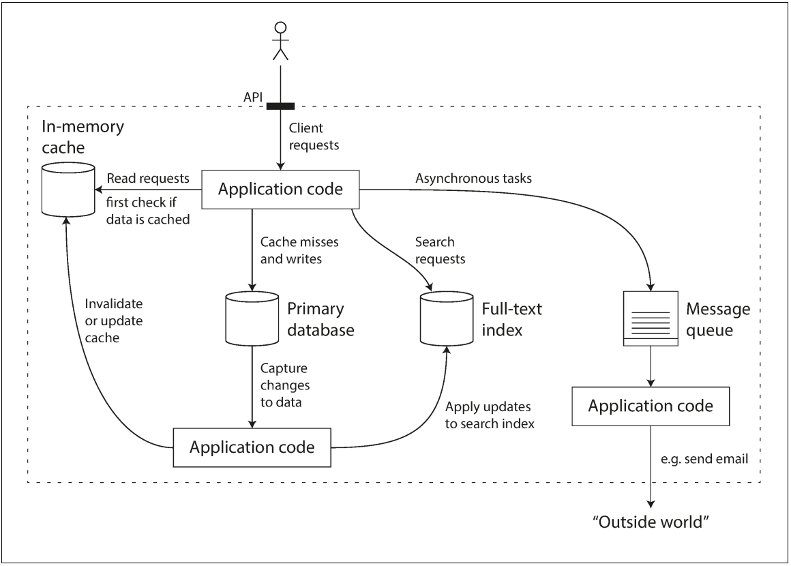
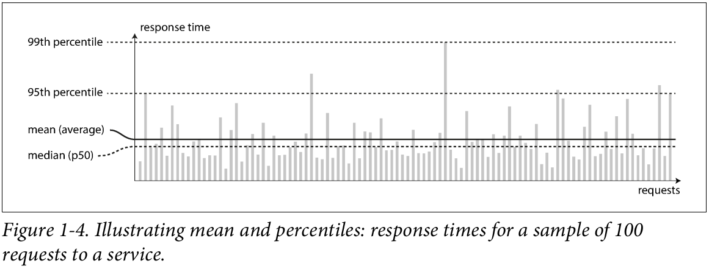

# Chapter 1 - Reliable, Scalable, and Maintainable Applications

Many applications today are data-intensive, as opposed to compute-intensive. Raw
CPU power is rarely a limiting factor for these applications—bigger problems are
usually the amount of data, the complexity of data, and the speed at which it is
changing.

A data-intensive application is typically built from standard building blocks that pro‐
vide commonly needed functionality. For example, many applications need to:

* Store data so that they, or another application, can find it again later (databases)
* Remember the result of an expensive operation, to speed up reads (caches)
* Allow users to search data by keyword or filter it in various ways (search indexes)
* Send a message to another process, to be handled asynchronously (stream pro‐
cessing)
* Periodically crunch a large amount of accumulated data (batch processing)

There are many database systems with different charac‐
teristics, because different applications have different requirements. There are vari‐
ous approaches to caching, several ways of building search indexes, and so on. When
building an application, we still need to figure out which tools and which approaches
are the most appropriate for the task at hand. And it can be hard to combine tools
when you need to do something that a single tool cannot do alone.

## Thinking About Data Systems

We typically think of databases, queues, caches, etc. as being very different categories
of tools. Although a database and a message queue have some superficial similarity—
both store data for some time—they have very different access patterns, which means
different performance characteristics, and thus very different implementations.

Many new tools for data storage and processing have emerged in recent years. They
are optimized for a variety of different use cases, and they no longer neatly fit into
traditional categories [1]. For example, there are datastores that are also used as mes‐
sage queues (Redis), and there are message queues with database-like durability guar‐
antees (Apache Kafka). The boundaries between the categories are becoming blurred.

For example, if you have an application-managed caching layer (using Memcached
or similar), or a full-text search server (such as Elasticsearch or Solr) separate from
your main database, it is normally the application code’s responsibility to keep those
caches and indexes in sync with the main database. Figure 1-1 gives a glimpse of what
this may look like (we will go into detail in later chapters).

We focus on three concerns that are important in most software systems:

## Reliability
The system should continue to work correctly(performing the correct function at the desired level of performance) even in the face of adversity (hardware or soft‐ware faults, and even human error). The former term is slightly
misleading: it suggests that we could make a system tolerant of every possible kind of
fault, which in reality is not feasible

Note that a fault is not the same as a failure [2]. A fault is usually defined as one com‐
ponent of the system deviating from its spec, whereas a failure is when the system as a
whole stops providing the required service to the user. It is impossible to reduce the
probability of a fault to zero; therefore it is usually best to design fault-tolerance
mechanisms that prevent faults from causing failures.

## Scalability
As the system grows (in data volume, traffic volume, or complexity), there should be reasonable ways of dealing with that growth.

Even if a system is working reliably today, that doesn’t mean it will necessarily work reliably in the future. One common reason for degradation is increased load: perhaps the system has grown from 10,000 concurrent users to 100,000 concurrent users, or from 1 million to 10 million. Perhaps it is processing much larger volumes of data than it did before.

### Describing Load

What happens if our load doubles?

The best choice of parameters depends on the architecture of your system: it may be requests per second to a web server, the ratio of reads to writes in a database, the number of simultaneously active
users in a chat room, the hit rate on a cache, or something else.

To make this idea more concrete, let’s consider Twitter as an example, using data published in November 2012 [16]. Two of Twitter’s main operations are:

#### Post tweet

A user can publish a new message to their followers (4.6k requests/sec on average, over 12k requests/sec at peak).

#### Home timeline
A user can view tweets posted by the people they follow (300k requests/sec).

### Describing Performance

Once you have described the load on your system, you can investigate what happens when the load increases. You can look at it in two ways:

• When you increase a load parameter and keep the system resources (CPU, memory, network bandwidth, etc.) unchanged, how is the performance of your system
affected?

• When you increase a load parameter, how much do you need to increase the resources if you want to keep performance unchanged?

    Latency and response time Latency and response time are often used synonymously, but they are not the same. The response time is what the client sees: besides the actual time to process the request (the service time), it includes network delays and queueing delays. Latency is the duration that a request is waiting to be handled—during which it is latent, awaiting service

Even if you only make the same request over and over again, you’ll get a slightly different response time on every try. In practice, in a system handling a variety of requests, the response time can vary a lot. We therefore need to think of response time not as a single number, but as a distribution of values that you can measure.

In Figure 1-4, each gray bar represents a request to a service, and its height shows how long that request took. Most requests are reasonably fast, but there are occasional outliers that take much longer. Perhaps the slow requests are intrinsically more
expensive, e.g., because they process more data. But even in a scenario where you’d think all requests should take the same time, you get variation: random additional latency could be introduced by a context switch to a background process, the loss of a network packet and TCP retransmission, a garbage collection pause, a page fault forcing a read from disk, mechanical vibrations in the server rack [18], or many other causes.

Usually it is better to use percentiles than mean. Because mean doesn’t tell you how many users actually experienced that delay If you take your list of response times and sort it from fastest to slowest, then the median is the halfway point: for example, if your median response time is 200 ms, that means half your requests return in less than 200 ms, and half your requests take longer than that.

## Maintainability
Over time, many different people will work on the system (engineering and oper‐ations, both maintaining current behavior and adapting the system to new use cases), and they should all be able to work on it productively.

It is well known that the majority of the cost of software is not in its initial development, but in its ongoing maintenance—fixing bugs, keeping its systems operational, investigating failures, adapting it to new platforms, modifying it for new use cases,
repaying technical debt, and adding new features.

However, we can and should design software in such a way that it will hopefully minimize pain during maintenance, and thus avoid creating legacy software ourselves. To this end, we will pay particular attention to three design principles for software
systems:

* Operability (Making Life Easy for Operations)

    * Make it easy for operations teams to keep the system running smoothly.
    * Monitoring the health of the system and quickly restoring service if it goes into a bad state
    * Keeping tabs on how different systems affect each other, so that a problematic change can be avoided before it causes damage
    * Preserving the organization’s knowledge about the system, even as individual people come and go

* Simplicity (Managing Complexity)

    * Make it easy for new engineers to understand the system, by removing as much complexity as possible from the system. 
    * One of the best tools we have for removing accidental complexity is abstraction. A good abstraction can hide a great deal of implementation detail behind a clean, simple-to-understand façade. A good abstraction can also be used for a wide range of different applications. Not only is this reuse more efficient than reimplementing a similar thing multiple times, but it also leads to higher-quality software, as quality improvements in the abstracted component benefit all applications that use it.

* Evolvability (Making Change Easy) 
    * Make it easy for engineers to make changes to the system in the future, adapting it for unanticipated use cases as requirements change. Also known as extensibility, modifiability, or plasticity.

## Summary

In this chapter, we have explored some fundamental ways of thinking about data intensive applications. These principles will guide us through the rest of the book, where we dive into deep technical detail.

Reliability means making systems work correctly, even when faults occur. Faults can be in hardware (typically random and uncorrelated), software (bugs are typically systematic and hard to deal with), and humans (who inevitably make mistakes from time to time). Fault-tolerance techniques can hide certain types of faults from the end user.

Scalability means having strategies for keeping performance good, even when load increases. In order to discuss scalability, we first need ways of describing load and performance quantitatively. We briefly looked at Twitter’s home timelines as an example of describing load, and response time percentiles as a way of measuring performance. In a scalable system, you can add processing capacity in order to remain reliable under high load.

Maintainability has many facets, but in essence it’s about making life better for the engineering and operations teams who need to work with the system. Good abstractions can help reduce complexity and make the system easier to modify and adapt for new use cases. Good operability means having good visibility into the system’s health, and having effective ways of managing it.

