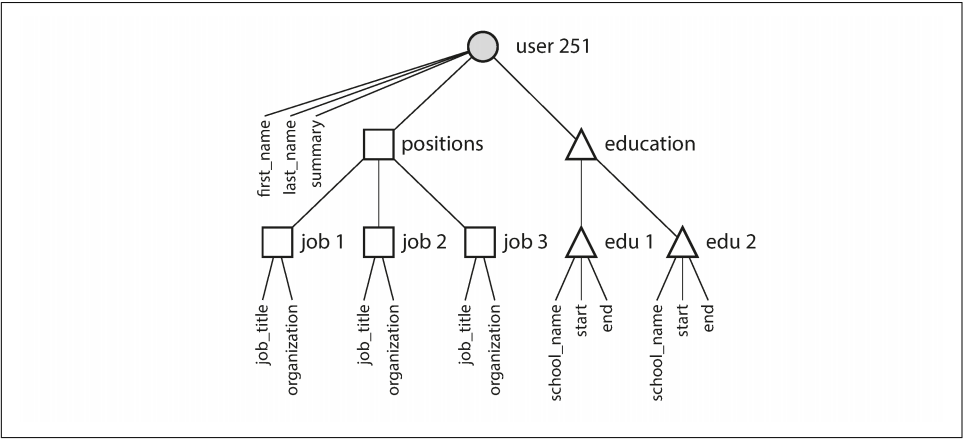

# Chapter 2 - Data Models and Query Languages

Data models are perhaps the most important part of developing software, because they have such a profound effect: not only on how the software is written, but also on how we think about the problem that we are solving.

Most applications are built by layering one data model on top of another. For each layer, the key question is: how is it _represented_ in terms of the next-lower layer.

Good examples are:

- Application developers model the real world (people, merchants, organizations, orders and orders items, etc) using objects or data structures that can be manipulated using APIs using tools like high level programming languages.
- Engineers who develop the programming languages we use designed a way to represent the objects and data structures we create in bytes in the computer memory and machine instructions in a low level programming language.
- Hardware engineers figured out a way to represent the bytes in and instructions in terms of electrical currents, electrical voltages, pulses of light, magnetic fields and more.

Complex application have a lot of intermediary levels, such as APIs built upon APIs, but the basic idea is still the same: each layer hides the complexity of the layers below it by providing a clean **data model**.

There are many different kinds of data models, and every data model embodies assumptions about how it is going to be used. Some kinds of usage are easy and some are not supported; some operations are fast and some perform badly; some data transformations fell natural and some are awkward.

## Relational Model Versus Document Model

The best-known data model today is probably that of **SQL**, based on the relational model proposed by Edgar Codd in 1970: data is organized into _relations_ (called _tables_ in SQL), where each relation is an unordered collection of _tuples_ (_rows_ in SQL).

There's no denial that SQL alongside its relational **Relational Database Management Systems** (RDBMSes) had become the tools of choice for most people who need to store and query data with some kind of regular structure. Innovative at the time, SQL made things like _transactional processing_ (sales or bank transactions, airline reservations and stock-keeping in warehouses) and _batch processing_ (customer invoicing, payroll, reporting) easier to achieve and simpler to do.

Other databases at that time forced application developers to think a lot about the internal representation of the data in the database. The goal of te relational model was to hide that implementation detail behind a cleaner interface. Although alternatives did exist by the time, and many other were created, the relational model came to dominate them all, each competitor rising with a lot of hype in its time, but never lasting in the end.

Computers became vastly more powerful and networked, they started being used for increasingly diverse purposes. And remarkably, relational databases turned out to generalize very well, beyond their original scope of business data processing, to a broad variety of use cases. Much of the web today is still powered by relational databases, be it online publishing, discussion, social networking, ecommerce, games software-as-a-service productivity applications, or much more.

## The Birth of NoSQL

The name “NoSQL” is unfortunate, since it doesn’t actually refer to any particular technology—it was originally intended simply as a catchy Twitter hashtag for a meetup on open source, distributed, nonrelational databases in 2009. A number of interesting database systems are now associated with the #NoSQL hashtag, and it has been retroactively reinterpreted as Not Only SQL.

There are several driving forces behind the adoption of NoSQL databases, including:

- A need for greater scalability than relational databases can easily achieve, including very large datasets or very high write throughput
- A widespread preference for free and open source software over commercial database products
- Specialized query operations that are not well supported by the relational model
- Frustration with the restrictiveness of relational schemas, and a desire for a more
  dynamic and expressive data model

Different applications have different requirements, and the best choice of technology
for one use case may well be different from the best choice for another use case. It
therefore seems likely that in the foreseeable future, relational databases will continue to be used alongside a broad variety of nonrelational datastores—an idea that is sometimes called _polyglot persistence_.

## The Object-Relational Mismatch

A common criticism of the SQL data model: if data is stored in relational tables, an awkward translation layer is required between the objects in the application code and the database model of tables, rows, and columns. The disconnect between the models is sometimes called an _impedance mismatch_.

Object-relational mapping (ORM) frameworks like ActiveRecord and Hibernate reduce the amount of boilerplate code required for this translation layer, but they can’t completely hide the differences between the two models.

The following figure illustrates how a résumé (a LinkedIn profile) could be expressed in a relational schema. The profile as a whole can be identified by a unique identifier, user_id. Fields like first_name and last_name appear exactly once per user, so they can be modeled as columns on the users table. However, most people have had more than one job in their career (positions), and people may have varying numbers of periods of education and any number of pieces of contact information. There is a one-to-many relationship from the user to these items, which can be represented in various ways:

- In the traditional SQL model (prior to SQL:1999), the most common normalized representation is to put positions, education, and contact information in separate tables, with a foreign key reference to the users table.
- Later versions of the SQL standard added support for structured datatypes and XML data; this allowed multi-valued data to be stored within a single row, with support for querying and indexing inside those documents. These features are supported to varying degrees by Oracle, IBM DB2, MS SQL Server, and PostgreSQL [6, 7]. A JSON datatype is also supported by several databases, including IBM DB2, MySQL, and PostgreSQL.
- A third option is to encode jobs, education, and contact info as a JSON or XML document, store it on a text column in the database, and let the application interpret its structure and content. In this setup, you typically cannot use the database to query for values inside that encoded column.


For a data structure like a résumé, which is mostly a self-contained document, a JSON representation can be quite appropriate:

```json
{
  "user_id": 251,
  "first_name": "Bill",
  "last_name": "Gates",
  "summary": "Co-chair of the Bill & Melinda Gates... Active blogger.",
  "region_id": "us:91",
  "industry_id": 131,
  "photo_url": "/p/7/000/253/05b/308dd6e.jpg",
  "positions": [
    {
      "job_title": "Co-chair",
      "organization": "Bill & Melinda Gates Foundation"
    },
    { "job_title": "Co-founder, Chairman", "organization": "Microsoft" }
  ],
  "education": [
    { "school_name": "Harvard University", "start": 1973, "end": 1975 },
    { "school_name": "Lakeside School, Seattle", "start": null, "end": null }
  ],
  "contact_info": {
    "blog": "http://thegatesnotes.com",
    "twitter": "http://twitter.com/BillGates"
  }
}
```

Some developers feel that the JSON model reduces the impedance mismatch between the application code and the storage layer.

The JSON representation has better locality than the multi-table schema in the previous figure. If you want to fetch a profile in the relational example, you need to either perform multiple queries (query each table by user_id) or perform a messy multi way join between the users table and its subordinate tables. In the JSON representation, all the relevant information is in one place, and one query is sufficient.

The **one-to-many** relationships from the user profile to the user’s positions, educational history, and contact information imply a tree structure in the data, and the JSON representation makes this tree structure explicit.



## Many-to-One and Many-to-Many Relationships

In the résumé example, _region_id_ and _industry_id_ are given as IDs, not as plain-text strings "Greater Seattle Area" and "Philanthropy".

Whether you store an ID or a text string is a question of duplication. When you use an ID, the information that is meaningful to humans (such as the word Philanthropy) is stored in only one place, and everything that refers to it uses an ID (which only has meaning within the database). When you store the text directly, you are duplicating the human-meaningful information in every record that uses it.

The advantage of using an ID is that because it has no meaning to humans, it never needs to change: the ID can remain the same, even if the information it identifies changes. Anything that is meaningful to humans may need to change sometime in the future—and if that information is duplicated, all the redundant copies need to be updated. That incurs write overheads, and risks inconsistencies (where some copies of the information are updated but others aren’t). Removing such duplication is the key idea behind normalization in databases.

Unfortunately, normalizing this data requires **many-to-one** relationships (many people live in one particular region, many people work in one particular industry), which don’t fit nicely into the document model. In relational databases, it’s normal to refer to rows in other tables by ID, because joins are easy. In document databases, joins are not needed for **one-to-many** tree structures, and support for joins is often weak, the work of making the join is shifted from the database to the application code.

## Are Document Databases Repeating History?

While many-to-many relationships and joins are routinely used in relational databases, document databases and NoSQL reopened the debate on how best to represent such relationships in a database. This debate is much older than NoSQL—in fact, it goes back to the very earliest computerized database systems.

Like document databases, IMS worked well for one-to-many relationships, but it made many-to-many relationships difficult, and it didn’t support joins. Developers had to decide whether to duplicate (denormalize) data or to manually resolve references from one record to another.

### The network mode

The CODASYL model was a generalization of the hierarchical model. In the tree structure of the hierarchical model, every record has exactly one parent; in the network model, a record could have multiple parents.

The links between records in the network model were not foreign keys, but more like pointers in a programming language (while still being stored on disk). The only way of accessing a record was to follow a path from a root record along these chains of links. This was called an access path.

Although manual access path selection was able to make the most efficient use of the very limited hardware capabilities in the 1970s (such as tape drives, whose seeks are extremely slow), the problem was that they made the code for querying and updating the database complicated and inflexible.

### The relational model

What the relational model did, by contrast, was to lay out all the data in the open: a relation (table) is simply a collection of tuples (rows), and that’s it. There are no labyrinthine nested structures, no complicated access paths to follow if you want to look at the data. You can read any or all of the rows in a table, selecting those that match an arbitrary condition. You can read a particular row by designating some columns as a key and matching on those. You can insert a new row into any table without worrying about foreign key relationships to and from other tables.

The relational model thus made it much easier to add new features to applications.

Query optimizers for relational databases are complicated beasts, and they have consumed many years of research and development effort. But a key insight of the relational model was this: you only need to build a query optimizer once, and then all applications that use the database can benefit from it. If you don’t have a query optimizer, it’s easier to hand code the access paths for a particular query than to write a general-purpose optimizer—but the general-purpose solution wins in the long run.

### Comparison to document databases

Document databases reverted back to the hierarchical model in one aspect: storing nested records (one-to-many relationships, like positions, education, and contact_info in the résumé example) within their parent record rather than in a separate table.

However, when it comes to representing many-to-one and many-to-many relationships, relational and document databases are not fundamentally different: in both cases, the related item is referenced by a unique identifier, which is called a foreign key in the relational model and a document reference in the document model. That identifier is resolved at read time by using a join or follow-up queries. To date, document databases have not followed the path of CODASYL.

## Relational Versus Document Databases Today

The main arguments in favor of the document data model are schema flexibility, better performance due to locality, and that for some applications it is closer to the data structures used by the application. The relational model counters by providing better support for joins, and many-to-one and many-to-many relationships.

### Which data model leads to simpler application code?

If the data in your application has a document-like structure (i.e., a tree of one-to-many relationships, where typically the entire tree is loaded at once), then it’s probably a good idea to use a document model. The relational technique of shredding -- splitting a document-like structure into multiple tables (like positions, education, and contact_info in Figure 2-1)—can lead to cumbersome schemas and unnecessarily complicated application code.

The poor support for joins in document databases may or may not be a problem, depending on the application. For example, many-to-many relationships may never be needed in an analytics application that uses a document database to record which events occurred at which time

However, if your application does use many-to-many relationships, the document model becomes less appealing. It’s possible to reduce the need for joins by denormalizing, but then the application code needs to do additional work to keep the denormalized data consistent. Joins can be emulated in application code by making multiple requests to the database, but that also moves complexity into the application and is usually slower than a join performed by specialized code inside the database. In such cases, using a document model can lead to significantly more complex application code and worse performance

It’s not possible to say in general which data model leads to simpler application code; it depends on the kinds of relationships that exist between data items. For highly interconnected data, the document model is awkward, the relational model is acceptable, and graph models are the most natural.

### Schema flexibility in the document mode

Most document databases, and the JSON support in relational databases, do not enforce any schema on the data in documents. XML support in relational databases usually comes with optional schema validation. No schema means that arbitrary keys and values can be added to a document, and when reading, clients have no guarantees as to what fields the documents may contain.

Document databases are sometimes called _schemaless_, but that’s misleading, as the code that reads the data usually assumes some kind of structure, there is an implicit schema, but it is not enforced by the database. A more accurate term is _schema-on-read_ (the structure of the data is implicit, and only interpreted when the data is read), in contrast with _schema-on-write_ (the traditional approach of relational databases, where the schema is explicit and the database ensures all written data conforms to it).

Schema-on-read is similar to dynamic (runtime) type checking in programming languages, whereas schema-on-write is similar to static (compile-time) type checking.

The schema-on-read approach is advantageous if the items in the collection don’t all have the same structure for some reason for example, because:

- There are many different types of objects, and it is not practical to put each type of object in its own table.
- The structure of the data is determined by external systems over which you have no control and which may change at any time.

### Data locality for queries

A document is usually stored as a single continuous string, encoded as JSON, XML, or a binary variant thereof (such as MongoDB’s BSON). If your application often needs to access the entire document (for example, to render it on a web page), there is a performance advantage to this storage locality. If data is split across multiple tables, like in Figure 2-1, multiple index lookups are required to retrieve it all, which may require more disk seeks and take more time.

The locality advantage only applies if you need large parts of the document at the same time. The database typically needs to load the entire document, even if you access only a small portion of it, which can be wasteful on large documents. On updates to a document, the entire document usually needs to be rewritten—only modifications that don’t change the encoded size of a document can easily be performed in place [19]. For these reasons, it is generally recommended that you keep documents fairly small and avoid writes that increase the size of a document [9]. These performance limitations significantly reduce the set of situations in which document databases are useful.

### Convergence of document and relational databases

Most relational databases nowadays have supported both XML and JSON documents for quite some time. Similarly, document databases are gradually adding support for relational-like query language. It seems that relational and document databases are becoming more similar over time, and that is a good thing: the data models complement each other.

## Query Languages for Data

When the relational model was introduced, it included a new way of querying data: SQL is a _declarative_ query language, whereas IMS and CODASYL queried the database using _imperative_ code.

An imperative language tells the computer to perform certain operations in a certain order. You can imagine stepping through the code line by line, evaluating conditions, updating variables, and deciding whether to go around the loop one more time.

In a declarative query language, like SQL or relational algebra, you just specify the pattern of the data you want—what conditions the results must meet, and how you want the data to be transformed (e.g., sorted, grouped, and aggregated)—but not how to achieve that goal. It is up to the database system’s query optimizer to decide which indexes and which join methods to use, and in which order to execute various parts of the query.

A declarative query language is attractive because it is typically more concise and easier to work with than an imperative API. But more importantly, it also hides implementation details of the database engine, which makes it possible for the database system to introduce performance improvements without requiring any changes to queries.

The fact that SQL is more limited in functionality gives the database much more room for automatic optimizations.

Finally, imperative code is very hard to parallelize across multiple cores and multiple machines, because it specifies instructions that must be performed in a particular order. Declarative languages have a better chance of getting faster in parallel execution because they specify only the pattern of the results, not the algorithm that is used to determine the results. The database is free to use a parallel implementation of the query language, if appropriate.

## MapReduce Querying

MapReduce is a programming model for processing large amounts of data in bulk across many machines, popularized by Google. A limited form of MapReduce is supported by some NoSQL datastores, including MongoDB and CouchDB, as a mechanism for performing read-only queries across many documents.

MapReduce is neither a declarative query language nor a fully imperative query API, but somewhere in between: the logic of the query is expressed with snippets of code, which are called repeatedly by the processing framework. It is based on the map (also known as **collect**) and reduce (also known as **fold** or **inject**) functions that exist in many functional programming languages.

The map and reduce functions are somewhat restricted in what they are allowed to do. They must be pure functions, which means they only use the data that is passed to them as input, they cannot perform additional database queries, and they must not have any side effects. These restrictions allow the database to run the functions anywhere, in any order, and rerun them on failure. However, they are nevertheless powerful: they can parse strings, call library functions, perform calculations, and more.

## Graph-Like Data Models

We saw earlier that many-to-many relationships are an important distinguishing feature between different data models. If your application has mostly one-to-many relationships (tree-structured data) or no relationships between records, the document model is appropriate.

But what if many-to-many relationships are very common in your data? The relational model can handle simple cases of many-to-many relationships, but as the connections within your data become more complex, it becomes more natural to start modeling your data as a graph.

A graph consists of two kinds of objects: vertices (also known as nodes or entities) and edges (also known as relationships or arcs). Many kinds of data can be modeled as a graph. Typical examples include:

_Social graphs_
Vertices are people, and edges indicate which people know each other.

_The web graph_
Vertices are web pages, and edges indicate HTML links to other pages.

_Road or rail networks_
Vertices are junctions, and edges represent the roads or railway lines between them.

In the examples just given, all the vertices in a graph represent the same kind of thing (people, web pages, or road junctions, respectively). However, graphs are not limited to such homogeneous data: an equally powerful use of graphs is to provide a consistent way of storing completely different types of objects in a single datastore.

The following figure shows an example of data modeling with graph. It could be taken from a social network or a genealogical database: it shows two people, Lucy from Idaho and Alain from Beaune, France. They are married and living in London.


## Property Graphs

In the property graph model, each vertex consists of:

- A unique identifier
- A set of outgoing edges
- A set of incoming edges
- A collection of properties (key-value pairs)
  Each edge consists of:
- A unique identifier
- The vertex at which the edge starts (the tail vertex)
- The vertex at which the edge ends (the head vertex)
- A label to describe the kind of relationship between the two vertices
- A collection of properties (key-value pairs)

- The vertex at which the edge ends (the head vertex)
- A label to describe the kind of relationship between the two vertices
- A collection of properties (key-value pairs)

We can think of a graph store as consisting of two relational tables, one for vertices and one for edges, as shown in the following code (this schema uses the PostgreSQL json datatype to store the properties of each vertex or edge).

```sql
CREATE TABLE vertices (
  vertex_id integer PRIMARY KEY,
  properties json
);
CREATE TABLE edges (
  edge_id
  integer PRIMARY KEY,
  tail_vertex integer REFERENCES vertices (vertex_id),
  head_vertex integer REFERENCES vertices (vertex_id),
  label
  text,
  properties json
);
CREATE INDEX edges_tails ON edges (tail_vertex);
CREATE INDEX edges_heads ON edges (head_vertex);
```

## The Cypher Query Language

Cypher is a declarative query language for property graphs, created for the Neo4j graph database.

The following code shows the Cypher query to insert the lefthand portion of the previous example into a graph database. The rest of the graph can be added similarly and is omitted for readability. Each vertex is given a symbolic name like USA or Idaho , and other parts of the query can use those names to create edges between the vertices, using an arrow notation: (Idaho) -[:WITHIN]-> (USA) creates an edge labeled WITHIN , with Idaho as the tail node and USA as the head node.

```cypher
CREATE
  (NAmerica:Location {name:'North America', type:'continent' }),
  (USA:Location {name:'United States', type:'country' }),
  (Idaho:Location {name:'Idaho', type:'state' }),
  (Lucy:Person {name:'Lucy' }),

  (Idaho) -[:WITHIN]-> (USA) -[:WITHIN]-> (NAmerica),
  (Lucy) -[:BORN_IN]-> (Idaho)
```

And the following code shows how to query all the people born in USA that emigrated to Europe:

```cypher
MATCH
  (person) -[:BORN_IN]-> () -[:WITHIN*0..]-> (us:Location {name:'United States'}),
  (person) -[:LIVES_IN]-> () -[:WITHIN*0..]-> (eu:Location {name:'Europe'})
RETURN person.name
```

The query can be read as follows:

Find any vertex (call it person ) that meets both of the following conditions:

1. person has an outgoing BORN_IN edge to some vertex. From that vertex, you can follow a chain of outgoing WITHIN edges until eventually you reach a vertex of type Location , whose name property is equal to "United States" .
2. That same person vertex also has an outgoing LIVES_IN edge. Following that edge, and then a chain of outgoing WITHIN edges, you eventually reach a vertex of type Location , whose name property is equal to "Europe".
   For each such person vertex, return the name property.

## Graph Queries in SQL

If we put graph data in a relational structure, we can also query it using SQL but with some difficulty. The following is an example of the same query written in SQL the _vertices_ and _edges_ tables:

```sql
WITH RECURSIVE
  -- in_usa is the set of vertex IDs of all locations within the United States
  in_usa(vertex_id) AS (
    SELECT vertex_id
    FROM vertices
    WHERE properties->>'name' = 'United States'

    UNION

    SELECT edges.tail_vertex
    FROM edges
    JOIN in_usa ON edges.head_vertex = in_usa.vertex_id
    WHERE edges.label = 'within'
  ),

  -- in_europe is the set of vertex IDs of all locations within Europe
  in_europe(vertex_id) AS (
    SELECT vertex_id
    FROM vertices
    WHERE properties->>'name' = 'Europe'

    UNION

    SELECT edges.tail_vertex
    FROM edges
    JOIN in_europe ON edges.head_vertex = in_europe.vertex_id
    WHERE edges.label = 'within'
  ),

  -- born_in_usa is the set of vertex IDs of all people born in the US
  born_in_usa(vertex_id) AS (
    SELECT edges.tail_vertex
    FROM edges
    JOIN in_usa ON edges.head_vertex = in_usa.vertex_id
    WHERE edges.label = 'born_in'
  ),
  -- lives_in_europe is the set of vertex IDs of all people living in Europe
  lives_in_europe(vertex_id) AS (
    SELECT edges.tail_vertex
    FROM edges
    JOIN in_europe ON edges.head_vertex = in_europe.vertex_id
    WHERE edges.label = 'lives_in'
  )


SELECT vertices.properties->>'name'
FROM vertices
-- join to find those people who were both born in the US *and* live in Europe
JOIN born_in_usa
ON vertices.vertex_id = born_in_usa.vertex_id
JOIN lives_in_europe ON vertices.vertex_id = lives_in_europe.vertex_id;
```

The same query can be written in 4 lines in one query language but requires 29 lines in another, that just shows that different data models are designed to satisfy different use cases. It’s important to pick a data model that is suitable for your application.

## Triple-Stores and SPARQL

In a triple-store, all information is stored in the form of very simple three-part statements: (_subject_, _predicate_, _object_). For example, in the triple (_Jim_, _likes_, _bananas_), _Jim_ is the subject, _likes_ is the predicate (verb), and _bananas_ is the object.

The subject of a triple is equivalent to a vertex in a graph. The object is one of two things:

1. A value in a primitive datatype, such as a string or a number. In that case, the predicate and object of the triple are equivalent to the key and value of a property on the subject vertex. For example, (_lucy_, _age_, _33_) is like a vertex lucy with properties `{"age":33}` .
2. Another vertex in the graph. In that case, the predicate is an edge in the graph, the subject is the tail vertex, and the object is the head vertex. For example, in (_lucy_, _marriedTo_, _alain_) the subject and object _lucy_ and _alain_ are both vertices, and the predicate _marriedTo_ is the label of the edge that connects them.

The following shows the Lucy and Alain's graph written in a format called _Turtle_, a subset of _Notation3_ (_N3_)

```
@prefix : <urn:example:>.
_:lucy  a :Person.
_:lucy  :name "Lucy".
_:lucy  :bornIn _:idaho.

_:idaho a :Location.
_:idaho :name "Idaho".
_:idaho :type "state".
_:idaho :within _:usa.

_:usa a :Location.
_:usa :name "United States".
_:usa :type "country".
_:usa :within _:namerica.

_:namerica a :Location.
_:namerica :name "North America".
_:namerica :type "continent".
```

Or in a more concise way:

```
_:lucy  a :Person;  :name "Lucy";  :bornIn _:idaho.
_:idaho a :Location; :name "Idaho"; :type "state"; :within _:usa.
_:usa a :Location; :name "United States"; :type "country"; :within _:namerica.
_:namerica a :Location; :name "North America"; :type "continent".
```

`_:someName` represent the vertices while `:someName` represents the predicates, that can be properties like `:name "Lucy"` or edges like `:bornIn _:idaho`.

### The semantic web

The semantic web is fundamentally a simple and reasonable idea: websites already publish information as text and pictures for humans to read, so why don’t they also publish information as machine-readable data for computers to read? The _Resource Description Framework_ (_RDF_) was intended as a mechanism for different websites to publish data in a consistent format, allowing data from different websites to be automatically combined into a web of data — a kind of internet-wide “database of everything.”

### The RDF data model

The _Turtle_ language is a human-readable format for RDF data. A example of RDF/XML syntax follows for the same graph:

```xml
<Location rdf:nodeID="idaho">
    <name>Idaho</name>
    <type>state</type>
    <within>
        <Location rdf:nodeID="usa">
            <name>United States</name>
            <type>country</type>
            <within>
                <Location rdf:nodeID="namerica">
                    <name>North America</name>
                    <type>continent</type>
                </Location>
            </within>
        </Location>
    </within>
</Location><Person rdf:nodeID="lucy">
    <name>Lucy</name>
    <bornIn rdf:nodeID="idaho" />
</Person></rdf:RDF>
```

### The SPARQL query language

SPARQL is a query language for triple-stores using the RDF data model. It predates Cypher, and since Cypher’s pattern matching is borrowed from SPARQL, they look quite similar. The same query as before — finding people who have moved from the US to Europe — is even more concise in SPARQL than it is in Cypher:

```sparql
PREFIX : <urn:example:>

SELECT ?personName WHERE {
  ?person :name ?personName.
  ?person :bornIn / :within* / :name "United States".
  ?person :livesIn / :within* / :name "Europe".
}
```

SPARQL is a nice query language—even if the semantic web never happens, it can be a powerful tool for applications to use internally.

## The Foundation: Datalog

_Datalog_ is a much older language than SPARQL or Cypher, having been studied extensively by academics in the 1980s. It is less well known among software engineers, but it is nevertheless important, because it provides the foundation that later query languages build upon. Datalog is a subset of Prolog, which you might have seen before if you've studied computer science.

Datalog’s data model is similar to the triple-store model, generalized a bit. Instead of writing a triple as (subject, predicate, object), we write it as predicate(subject, object). The following example shows how to write the data from our example in Datalog.

```prolog
name(namerica, 'North America').
type(namerica, continent).

name(usa, 'United States').
type(usa, country).
within(usa, namerica).

name(idaho, 'Idaho').
type(idaho, state).
within(idaho, usa).

name(lucy, 'Lucy').
born_in(lucy, idaho).
```

And the following shows the same query as before:

```prolog
within_recursive(Location, Name) :- name(Location, Name). /* Rule 1 */

within_recursive(Location, Name) :- within(Location, Via), /* Rule 2 */
                                    within_recursive(Via, Name).

migrated(Name, BornIn, LivingIn) :- name(Person, Name), /* Rule 3 */
                                    born_in(Person, BornLoc),
                                    within_recursive(BornLoc, BornIn),
                                    lives_in(Person, LivingLoc),
                                    within_recursive(LivingLoc, LivingIn).

?- migrated(Who, 'United States', 'Europe').
/* Who = 'Lucy'. */
```

The following image shows how Datalog defines that Idaho is in North America applying the rule `within_recursive`:


The Datalog approach requires a different kind of thinking to the other query languages discussed in this chapter, but it’s a very powerful approach, because rules can be combined and reused in different queries. It’s less convenient for simple one-off queries, but it can cope better if your data is complex.

## Summary

Data models are a huge subject, and in this chapter we have taken a quick look at a broad variety of different models.

Historically, data started out being represented as one big tree (the hierarchical model), but that wasn’t good for representing many-to-many relationships, so the relational model was invented to solve that problem. More recently, developers found that some applications don’t fit well in the relational model either. New nonrelational “NoSQL” datastores have diverged in two main directions:

1. Document databases target use cases where data comes in self-contained documents and relationships between one document and another are rare.
2. Graph databases go in the opposite direction, targeting use cases where anything is potentially related to everything.

All three models (document, relational, and graph) are widely used today, and each is good in its respective domain.

One thing that document and graph databases have in common is that they typically don’t enforce a schema for the data they store, which can make it easier to adapt applications to changing requirements. However, your application most likely still assumes that data has a certain structure; it’s just a question of whether the schema is explicit (enforced on write) or implicit (handled on read).

Although we have covered a lot of ground, there are still many data models left unmentioned. To give just a few brief examples:

- Researchers working with genome data often need to perform sequence - similarity searches, which means taking one very long string (representing a DNA molecule) and matching it against a large database of strings that are similar, but not identical. None of the databases described here can handle this kind
  of usage, which is why researchers have written specialized genome database software like GenBank.
- Particle physicists have been doing Big Data–style large-scale data analysis for decades, and projects like the Large Hadron Collider (LHC) now work with hundreds of petabytes! At such a scale custom solutions are required to stop the hardware cost from spiraling out of control.
- Full-text search is arguably a kind of data model that is frequently used alongside databases. Information retrieval is a large specialist subject that we won’t cover in great detail in this book, but we’ll touch on search indexes in Chapter 3 and Part III.
