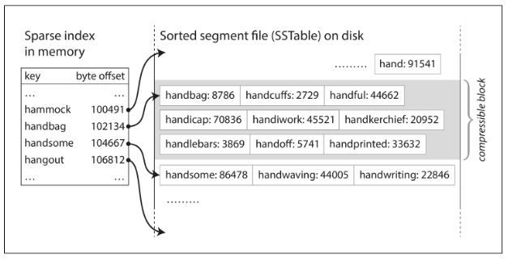
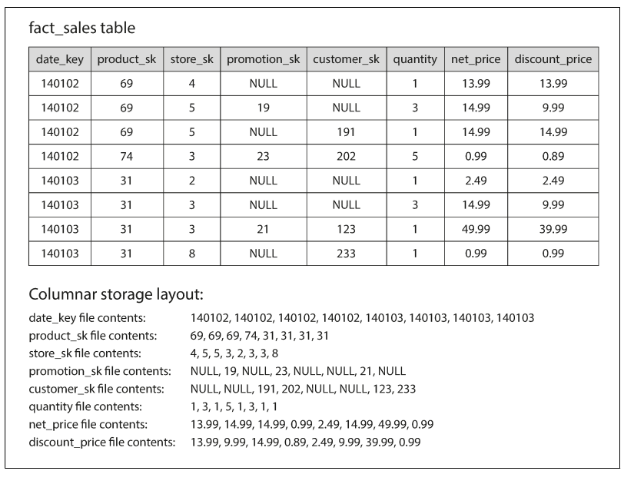

# Chapter 3 - Storage and Retrieval

Why should you, as an application developer, care how the database handles storage and retrieval internally? You’re probably not going to implement your own storage engine from scratch, but you do need to select a storage engine that is appropriate for your application, from the many that are available. In order to tune a storage engine to perform well on your kind of workload, you need to have a rough idea of what the storage engine is doing under the hood.

This two functions implement a key-value store. But there are a huge problem, it has a terrible performance on readings.

_db_get_ function has terrible performance if you have a large number of records in your database. Every time you want to look up a key, _db_get_ has to scan the entire database file from beginning to end.

In order to efficiently find the value for a particular key in the database, we need a different data structure: an index. The general idea behind them is to keep some additional metadata on the side, which acts as a signpost and helps you to locate the data you want.

An index is an additional structure that is derived from the primary data. Many databases allow you to add and remove indexes, and this doesn’t affect the contents of the
database; it only affects the performance of queries. Maintaining additional structures incurs overhead, especially on writes. For writes, it’s hard to beat the performance of simply appending to a file, because that’s the simplest possible write operation. Any kind of index usually slows down writes, because the index also needs to be updated every time data is written.

## Hash Indexes

The simplest possible indexing strategy is this: keep an in-memory hash map where every key is mapped to a byte offset in the data file. When you want to look up a value, use the hash map to find the offset in the data file, seek to that location, and read the value.

This may sound simplistic, but it is a viable approach. In fact, this is essentially what Bitcask (the default storage engine in Riak). Bitcask offers high-performance reads and writes, subject to the requirement that all the keys fit in the available RAM, since the hash map is kept completely in memory.

How do we avoid eventually running out o disk space? A good solution is to break the log into segments of a certain size by closing a segment file when it reaches a certain size, and making subsequent writes to a new segment file and perform compaction on these segments (throwing away duplicate keys and keeping the most recent update for each key).

We can also merge several segments together at the same time as performing the compaction. Segments are never modified after they have been written, so the merged segment is written to a new file. The merging and compaction of frozen segments can be done in a background thread, and while it is going on, we can still continue to serve read and write requests as normal, using the old segment files. After the merging process is complete, we switch read requests to using the new merged segment instead of the old segments—and then the old segment files can simply be deleted.

In order to find the value for a key, we first check the most recent segment’s hash map; if the key is not present we check the second-most-recent segment, and so on. The
merging process keeps the number of segments small, so lookups don’t need to check many hash maps.

If you want to delete a key and its associated value, you have to append a special deletion record to the data file (sometimes called a tombstone). When log segments are merged, the tombstone tells the merging process to discard any previous values for the deleted key.

The pros of this approach:

- Appending and segment merging are sequential write operations, which are generally much faster than random writes, especially on hard drives.
- Merging old segments avoids the problem of data files getting fragmented over time.
- Concurrency and crash recovery are much simpler if segment files are append-only or immutable.

The cons:

- The hash table must fit in memory. In principle, you could maintain a hash map on disk, but unfortunately it is difficult to make an on-disk hash map perform well
- Range queries are not efficient, you’d have to look up each key individually in the hash maps.

## SSTables and LSM-Trees

The _Sorted String Table_, or _SSTable_ for short, is a simple change on the hash index method - now the sequence of key-value pairs is sorted by key.

Merging segments is simple and efficient. You start reading the input files side by side, look at the first key in each file, copy the lowest key (according to the sort order) to
the output file, and repeat. This produces a new merged segment file, also sorted by key.

If the same key appears in several input segments, the merge will get the key in the last segment since segments are also sorted.

To maintain a SSTable sorted, all writes are added to an in-memory balanced tree data structure (memtable), whe the memtable gets bigger than some threshold (a few megabytes) - write out to disk as a SSTable file. The new SSTable file
becomes the most recent segment of the database.

In order to serve a read request, first try to find the key in the memtable, then in the most recent on-disk segment, then in the next-older segment, etc.

If the database crashes, the most recent writes (which are in the memtable but not yet written out to disk) are lost. In order to avoid that problem, we can keep a separate log on disk to which every write is immediately appended, just like in the previous section. That log is not in sorted order, but that doesn’t matter, because its only purpose is to restore the memtable after a crash. Every time the memtable is written out to an SSTable, the corresponding log can be discarded.

Pros over the hash index approach:

- In order to find a particular key in the file, you no longer need to keep an index of all the keys in memory. You still need an in-memory index to tell you the offsets for some of the keys, but it can be sparse: one key for every few kilobytes of segment file is sufficient, because a few kilobytes can be scanned very quickly.
- Since read requests need to scan over several key-value pairs in the requested range anyway, it is possible to group those records into a block and compress it before writing it to disk

Cons:

- The LSM-tree algorithm can be slow when looking up keys that do not exist in the database: you have to check the memtable, then the segments all the way back to the oldest (possibly having to read from disk for each one) before you can be sure that the key does not exist.

Lucene, an indexing engine for full-text search used by Elasticsearch uses a similar (but more complex) method for storing its term dictionary. Given a word in a
search query, find all the documents (web pages, product descriptions, etc.) that
mention the word. This is implemented with a key-value structure where the key is a
word (a term) and the value is the list of IDs of all the documents that contain the
word (the postings list).

## B-trees

The most widely adopted indexing structure, it's the standard index implementation in almost all relational databases, and many nonrelational databases too.

The log-structured indexes we saw earlier break the database down into variable-size segments, typically several megabytes or more in size, and always write a segment sequentially. By contrast, B-trees break the database down into fixed-size blocks or pages, traditionally 4 KB in size (sometimes bigger), and read or write one page at a time. This design corresponds more closely to the underlying hardware, as disks are
also arranged in fixed-size blocks.

Each page can be identified using an address or location, which allows one page to refer to another—similar to a pointer, but on disk instead of in memory. We can use
these page references to construct a tree of pages.

Moreover, some operations require several different pages to be overwritten. For
example, if you split a page because an insertion caused it to be overfull, you need to
write the two pages that were split, and also overwrite their parent page to update the
references to the two child pages. This is a dangerous operation, because if the data‐
base crashes after only some of the pages have been written, you end up with a cor‐
rupted index (e.g., there may be an orphan page that is not a child of any parent).

In general, pages can be positioned anywhere on disk; there is nothing requiring pages with nearby key ranges to be nearby on disk. If a query needs to scan over a
large part of the key range in sorted order, that page-by-page layout can be inefficient, because a disk seek may be required for every page that is read. Many B-tree implementations therefore try to lay out the tree so that leaf pages appear in sequential order on disk. However, it’s difficult to maintain that order as the tree grows. By contrast, since LSM-trees rewrite large segments of the storage in one go during merging, it’s easier for them to keep sequential keys close to each other on disk.

## Comparing B-Trees and LSM-Trees

Even though B-tree implementations are generally more mature than LSM-tree implementations, LSM-trees are also interesting due to their performance characteristics. As a rule of thumb, LSM-trees are typically faster for writes, whereas B-trees are thought to be faster for reads. Reads are typically slower on LSM-trees because they have to check several different data structures and SSTables at different stages of compaction.

A B-tree index must write every piece of data at least twice: once to the write-ahead log, and once to the tree page itself. There is also overhead from having to write an entire page at a time, even if only a few bytes in that page changed.

Moreover, LSM-trees are typically able to sustain higher write throughput than B-trees, partly because they sometimes have lower write amplification, and partly because they sequentially write compact SSTable files rather than having to overwrite several pages
in the tree. This difference is particularly important on magnetic hard drives, where sequential writes are much faster than random writes.

## Storing values within the index

The key in an index is the thing that queries search for, but the value could be the actual row or it could be a reference to the row stored elsewhere (head file). The heap file approach is common because it avoids duplicating data when multiple indexes are present. When updating a value without changing the key, the record can be overwritten in place, but if the new value is larger and there is not enough space, all indexes need to be updated to point at the new heap location of that record.
In MySQL the primary index is always a clustered index (storing all row data within the index) and SQLServer allows one clustered index per table, this allows some queries to be answered by using the index alone (cover the query).

## In memory Databases

When an in-memory database is restarted, it needs to reload its state, either from disk or over the network from a replica (unless special hardware is used). Despite writing
to disk, it’s still an in-memory database, because the disk is merely used as an append-only log for durability, and reads are served entirely from memory.

The performance advantage of in-memory databases is not due to the fact that they don’t need to read from disk. Even a disk-based storage engine may never need to read from disk if you have enough memory. Rather, they can be faster
because they can avoid the overheads of encoding in-memory data structures in a form that can be written to disk

## OLTP and OLAP

An application typically looks up a small number of records by some key, using an index. Records are inserted or updated based on the user’s input. Because these applications are interactive, the access pattern became known as online transaction processing (OLTP).

However, databases also started being increasingly used for data analytics, which has very different access patterns. Usually an analytic query needs to scan over a huge
number of records, only reading a few columns per record, and calculates aggregate statistics (such as count, sum, or average).

## Data Warehouse

Nevertheless, in the late 1980s and early 1990s, there was a trend for companies to stop using their OLTP systems for analytics purposes, and to run the analytics on a separate database instead. This separate database was called a data warehouse.

The main arguments in favor of the document data model are schema flexibility, better performance due to locality, and that for some applications it is closer to the data structures used by the application. The relational model counters by providing better support for joins, and many-to-one and many-to-many relationships.

On the surface, a data warehouse and a relational OLTP database look similar, because they both have a SQL query interface. However, the internals of the systems
can look quite different, because they are optimized for very different query patterns.
Many database vendors now focus on supporting either transaction processing or analytics workloads, but not both.

The data model of a data warehouse is most commonly relational, because SQL is generally a good fit for analytic queries. There are many graphical data analysis tools that generate SQL queries, visualize the results, and allow analysts to explore the data (through operations such as drill-down and slicing and dicing).

On the surface, a data warehouse and a relational OLTP database look similar, because they both have a SQL query interface. However, the internals of the systems
can look quite different, because they are optimized for very different query patterns.

Many database vendors now focus on supporting either transaction processing or analytics workloads, but not both.

## Column-Oriented Storage

Although fact tables are often over 100 columns wide, a typical data warehouse query only accesses 4 or 5 of them at one time.

In most OLTP databases, storage is laid out in a row-oriented fashion: all the values from one row of a table are stored next to each other. Document databases are similar: an entire document is typically stored as one contiguous sequence of bytes.

The idea behind column-oriented storage is simple: don’t store all the values from one row together, but store all the values from each column together instead. If each col‐
umn is stored in a separate file, a query only needs to read and parse those columns that are used in that query, which can save a lot of work.

The column-oriented storage layout relies on each column file containing the rows in the same order.

Most of the time, the bitmap encoding will be very effective in data warehouses queries because the data in one column probably will look quite repetitive.

### Column Compression

For example, if queries often target date ranges, such as the last month, it might make sense to make
date_key the first sort key. Then the query optimizer can scan only the rows from the
last month, which will be much faster than scanning all rows.

Another advantage of sorted order is that it can help with compression of columns. If the primary sort column does not have many distinct values, then after sorting, it will have long sequences where the same value is repeated many times in a row.

That compression effect is strongest on the first sort key. The second and third sort keys will be more jumbled up, and thus not have such long runs of repeated values.
Columns further down the sorting priority appear in essentially random order, so they probably won’t compress as well. But having the first few columns sorted is still
a win overall.

### Writing to Column-Oriented Storage

Column-oriented storage, compression, and sorting all help to make those read queries faster. However, they have the downside of making writes more difficult.

An update-in-place approach, like B-trees use, is not possible with compressed columns. If you wanted to insert a row in the middle of a sorted table, you would most
likely have to rewrite all the column files. As rows are identified by their position within a column, the insertion has to update all columns consistently.

Fortunately, we have already seen a good solution earlier in this chapter: LSM-trees.
All writes first go to an in-memory store, where they are added to a sorted structure and prepared for writing to disk. It doesn’t matter whether the in-memory store is
row-oriented or column-oriented. When enough writes have accumulated, they are merged with the column files on disk and written to new files in bulk.

## Aggregation: Data Cubes and Materialized Views

As discussed earlier, data warehouse queries often involve an aggregate function, such as COUNT, SUM, AVG, MIN, or MAX in SQL. If the same aggregates are used by many different queries, it can be wasteful to crunch through the raw data every time. Why not cache some of the counts or sums that queries use most often?

One way of creating such a cache is a materialized view: a table-like object whose contents are the results of some query.

When the underlying data changes, a materialized view needs to be updated, because it is a denormalized copy of the data. The database can do that automatically, but which is why materialized views are not often used in OLTP databases. In read-heavy data warehouses they can make more
sense

A common special case of a materialized view is known as a data cube or OLAP cube

