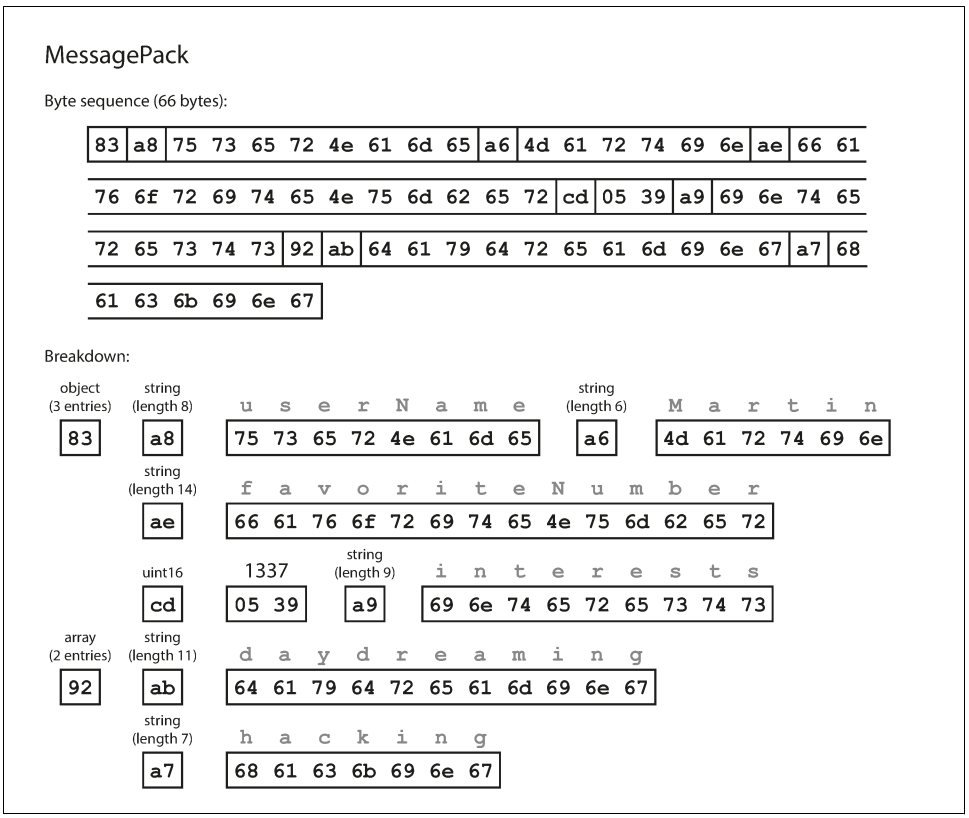
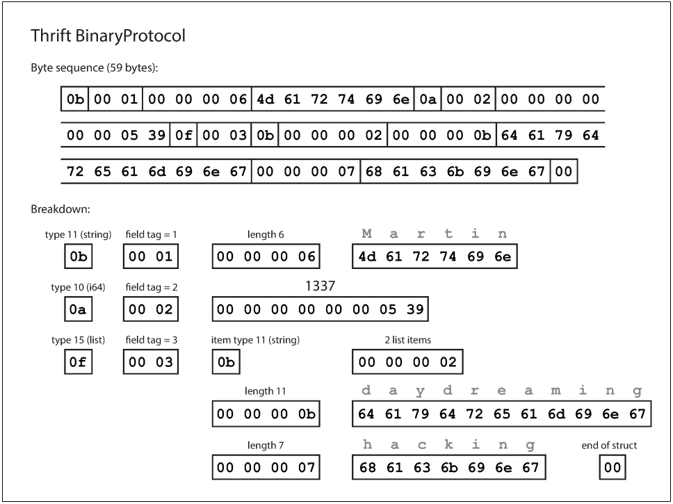
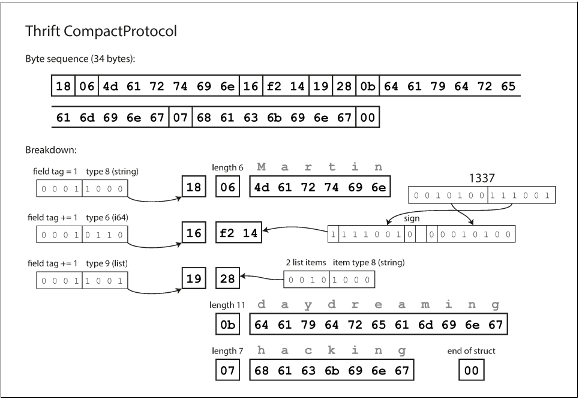
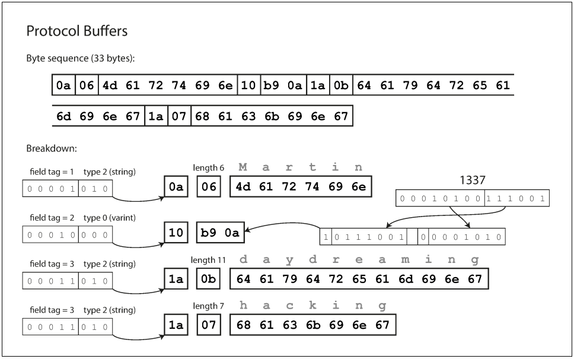
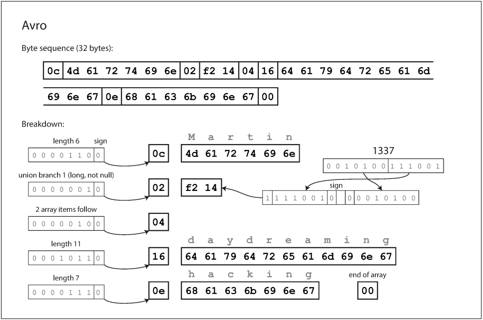
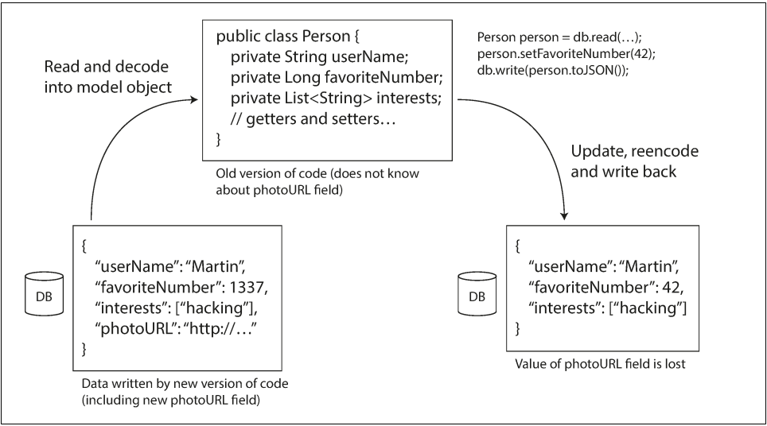

# Chapter 4 - Encoding and Evolution

Applications inevitably change over time. Features are added or modified as new products are launched, user requirements become better understood, or business circumstances change.

**Relational databases** generally assume that all data in the database conforms to one schema. By contrast, **schema-on-read** (“schemaless”) databases don’t enforce a schema, so the database can contain a mixture of older and newer data formats written at different times.

**Backward** compatibility is normally not hard to achieve: as author of the newer code, you know the format of data written by older code, and so you can explicitly handle it. **Forward** compatibility can be trickier, because it requires older code to ignore additions made by a newer version of the code.

In this chapter we will look at several formats for encoding data, including **JSON**, **XML**, **Protocol Buffers**, **Thrift**, and **Avro**. In particular, we will look at how they handle schema changes and how they support systems where old and new data and code need to coexist. We will then discuss how those formats are used for data storage and for communication: in web services, **Representational State Transfer** (REST), and **remote procedure calls** (RPC), as well as message-passing systems such as actors and message queues.

## Formats for Encoding Data

Programs usually work with data in (at least) two different representations:

1. **In memory**, data is kept in objects, structs, lists, arrays, hash tables, trees, and so on. These data structures are optimized for efficient access and manipulation by the CPU (typically using pointers).
2. When you want to write data to a file or send it over the network, you have to encode it as some kind of self-contained **sequence of bytes** (for example, a JSON document). Since a pointer wouldn’t make sense to any other process, this sequence-of-bytes representation looks quite different from the data structures that are normally used in memory

Thus, we need some kind of translation between the two representations. The translation from the in-memory representation to a byte sequence is called encoding (also known as serialization or marshalling), and the reverse is called decoding (parsing, deserialization, unmarshalling).

### Language-Specific Formats

Many programming languages come with built-in support for encoding in-memory objects into byte sequences. For example, Java has java.io.Serializable, Ruby has Marshal, Python has pickle, and so on. Many third-party libraries also exist, such as Kryo for Java.

These encoding libraries are very convenient, because they allow in-memory objects to be saved and restored with minimal additional code. it’s generally a bad idea to use your language’s built-in encoding for anything other than very transient purposes.

### JSON, XML, and Binary Variants

Moving to standardized encodings that can be written and read by many programming languages, JSON and XML are the obvious contenders. They are widely known, widely supported, and almost as widely disliked. XML is often criticized for being too verbose and unnecessarily complicated. JSON’s popularity is mainly due to its built-in support in web browsers (by virtue of being a subset of JavaScript) and simplicity relative to XML. CSV is another popular language-independent format, albeit less powerful. JSON, XML, and CSV are textual formats, and thus somewhat human-readable (although the syntax is a popular topic of debate). Besides the superficial syntactic issues

JSON, XML, and CSV are good enough for many purposes. It’s likely that they will remain popular, especially as data interchange formats (i.e., for sending data from one organization to another). In these situations, as long as people agree on what the format is, it often doesn’t matter how pretty or efficient the format is. The difficulty of getting different organizations to agree on anything outweighs most other concerns.

Example record which we will encode in several binary formats in this
chapter
```json
{
    "userName": "Martin",
    "favoriteNumber": 1337,
    "interests": ["daydreaming", "hacking"]
}
```

For data that is used only internally within your organization, there is less pressure to use a lowest-common-denominator encoding format. For example, you could choose a format that is more compact or faster to parse. For a small dataset, the gains are negligible, but once you get into the terabytes, the choice of data format can have a big impact.



The binary encoding is 66 bytes long, which is only a little less than the 81 bytes taken by the textual JSON encoding (with whitespace removed). All the binary encodings of JSON are similar in this regard. It’s not clear whether such a small space reduction (and perhaps a speedup in parsing) is worth the loss of human-readability.

### Thrift and Protocol Buffers

To encode the data in Thrift, you would describe the schema in the Thrift interface definition language (IDL) like this:
```
struct Person
    1: required string        userName,
    2: optional i64           favoriteNumber,
    3: optional list<string>  interests
}
```

The equivalent schema definition for Protocol Buffers looks very similar:
```
message Person {
    required string user_name       = 1;
    optional int64  favorite_number = 2;
    repeated string interests       = 3;
}
```

Thrift and Protocol Buffers each come with a code generation tool that takes a schema definition like the ones shown here, and produces classes that implement the schema in various programming languages. Your application code can call this generated code to encode or decode records of the schema.



The Thrift CompactProtocol encoding is semantically equivalent to BinaryProtocol, but  it packs the same information into only 34 bytes. It does this by packing the field type and tag number into a single byte, and by using variable-length integers. Bigger numbers use more bytes.



Finally, Protocol Buffers (which has only one binary encoding format), It does the bit packing slightly differently, but is otherwise very similar to Thrift’s CompactProtocol. Protocol Buffers fits the same record in 33 bytes.



As you can see from the examples, an encoded record is just the concatenation of its encoded fields. Each field is identified by its tag number and annotated with a datatype (e.g., string or integer). If a field value is not set, it is simply omitted from the encoded record.

As long as each field has a unique tag number, new code can always read old data, because the tag numbers still have the same meaning. If you were to add a field and make it required, that check would fail if new code read data written by old code, because the old code will not have written the new field that you added. Therefore, to maintain backward compatibility, every field you add after the initial deployment of the schema must be optional or have a default value.

Removing a field is just like adding a field, with backward and forward compatibility concerns reversed. That means you can only remove a field that is optional (a required field can never be removed), and you can never use the same tag number again (because you may still have data written somewhere that includes the old tag number, and that field must be ignored by new code).

New code can easily read data written by old code, because the parser can fill in any missing bits with zeros. However, if old code reads data written by new code, the old code is still using a 32-bit variable to hold the value. If the decoded 64-bit value won’t fit in 32-bits, it will be truncated.

A curious detail of Protocol Buffers is that it does not have a list or array datatype, but instead has a repeated marker for fields (which is a third option alongside required and optional ). The encoding of a repeated field is just what it says on the tin: the same field tag simply appears multiple times in the record. This has the nice effect that it’s okay to change an optional (single-valued) field into a repeated (multi-valued) field. New code reading old data sees a list with zero or one elements (depending on whether the field was present); old code reading new data sees only the last element of the list.

### Avro

Avro uses a schema to specify the structure of the data being encoded. It has two schema languages: one (Avro IDL) intended for human editing, and one (based on JSON) that is more easily machine-readable.

Our example schema, written in Avro IDL, might look like this:
```
record Person {
    string userName;
    union { null, long } favoriteNumber = null;
    array<string> interests;
}
```

The equivalent JSON representation of that schema is as follows:
```json
{
    "type": "record",
    "name": "Person",
    "fields": [
        {"name": "userName", "type": "string"},
        {"name": "favoriteNumber", "type": ["null", "long"], "default": null},
        {"name": "interests", "type": {"type": "array", "items": "string"}}
    ]
}
```

If you examine the byte sequence, you can see that there is nothing to identify fields or their datatypes. The encoding simply consists of values concatenated together. A string is just a length prefix followed by UTF-8 bytes, but there’s nothing in the encoded data that tells you that it is a string. It could just as well be an integer, or something else entirely. An integer is encoded using a variable-length encoding (the same as Thrift’s CompactProtocol).



They appear in the schema and use the schema to tell you the datatype of each field. This means that the binary data can only be decoded correctly if the code reading the data is using the exact same schema as the code that wrote the data. Any mismatch in the schema between the reader and the writer would mean incorrectly decoded data.

Avro doesn’t have optional and required markers in the same way as Protocol Buffers and Thrift do (it has union types and default values instead). Changing the datatype of a field is possible, provided that Avro can convert the type. Changing the name of a field is possible but a little tricky: the reader’s schema can contain aliases for field names, so it can match an old writer’s schema field names against the aliases. This means that changing a field name is backward compatible but not forward compatible. Similarly, adding a branch to a union type is backward compatible but not forward compatible.

Now, if the database schema changes (for example, a table has one column added and one column removed), you can just generate a new Avro schema from the updated database schema and export data in the new Avro schema. The data export process does not need to pay any attention to the schema change—it can simply do the schema conversion every time it runs. Anyone who reads the new data files will see that the fields of the record have changed, but since the fields are identified by name, the updated writer’s schema can still be matched up with the old reader’s schema.

By contrast, if you were using Thrift or Protocol Buffers for this purpose, the field tags would likely have to be assigned by hand: every time the database schema changes, an administrator would have to manually update the mapping from database column names to field tags. (It might be possible to automate this, but the schema generator would have to be very careful to not assign previously used field tags.) This kind of dynamically generated schema simply wasn’t a design goal of Thrift or Protocol Buffers, whereas it was for Avro.

Thrift and Protocol Buffers rely on code generation: after a schema has been defined, you can generate code that implements this schema in a programming language of your choice. This is useful in statically typed languages such as Java, C++, or C#, because it allows efficient in-memory structures to be used for decoded data, and it allows type checking and autocompletion in IDEs when writing programs that access the data structures.

In dynamically typed programming languages such as JavaScript, Ruby, or Python, there is not much point in generating code, since there is no compile-time type checker to satisfy. Code generation is often frowned upon in these languages, since they otherwise avoid an explicit compilation step. Moreover, in the case of a dynamically generated schema (such as an Avro schema generated from a database table), code generation is an unnecessarily obstacle to getting to the data. Avro provides optional code generation for statically typed programming languages, but it can be used just as well without any code generation. If you have an object container file (which embeds the writer’s schema), you can simply open it using the Avro library and look at the data in the same way as you could look at a JSON file. The file is self-describing since it includes all the necessary metadata.

### The Merits of Schemas

Many data systems also implement some kind of proprietary binary encoding for their data. For example, most relational databases have a network protocol over which you can send queries to the database and get back responses. Those protocols are generally specific to a particular database, and the database vendor provides a driver (e.g., using the ODBC or JDBC APIs) that decodes responses from the database’s network protocol into in-memory data structures. So, we can see that although textual data formats such as JSON, XML, and CSV are widespread, binary encodings based on schemas are also a viable option. They have a number of nice properties:

- They can be much more compact than the various “binary JSON” variants, since they can omit field names from the encoded data.
- The schema is a valuable form of documentation, and because the schema is required for decoding, you can be sure that it is up to date (whereas manually maintained documentation may easily diverge from reality).
- Keeping a database of schemas allows you to check forward and backward compatibility of schema changes, before anything is deployed.
- For users of statically typed programming languages, the ability to generate code from the schema is useful, since it enables type checking at compile time.

## Modes of Dataflow

Say you add a field to a record schema, and the newer code writes a value for that new field to the database. Subsequently, an older version of the code (which doesn’t yet know about the new field) reads the record, updates it, and writes it back. In this situation, the desirable behavior is usually for the old code to keep the new field intact, even though it couldn’t be interpreted.

### Dataflow Through Databases

The encoding formats discussed previously support such preservation of unknown fields, but sometimes you need to take care at an application level. For example, if you decode a database value into model objects in the application, and later reencode those model objects, the unknown field might be lost in that translation process. Solving this is not a hard problem.




### Dataflow Through Services: REST and RPC

The web works this way: clients (web browsers) make requests to web servers, making GET requests to download HTML, CSS, JavaScript, images, etc., and making POST requests to submit data to the server. The API consists of a standardized set of protocols and data formats (HTTP, URLs, SSL/TLS, HTML, etc.). Because web browsers, web servers, and website authors mostly agree on these standards, you can use any web browser to access any website (at least in theory!).

#### WebService

Web browsers are not the only type of client. For example, a native app running on a mobile device or a desktop computer can also make network requests to a server, and a client-side JavaScript application running inside a web browser can use XMLHttpRequest to become an HTTP client (this technique is known as Ajax). In this case, the server’s response is typically not HTML for displaying to a human, but rather data in an encoding that is convenient for further processing by the client- side application code (such as JSON). Although HTTP may be used as the transport protocol, the API implemented on top is application-specific, and the client andserver need to agree on the details of that API.

Moreover, a server can itself be a client to another service (for example, a typical web app server acts as client to a database). This approach is often used to decompose a large application into smaller services by area of functionality, such that one service makes a request to another when it requires some functionality or data from that other service. This way of building applications has traditionally been called a service-oriented architecture (SOA), more recently refined and rebranded as microservices architecture.

#### RPC

The RPC model tries to make a request to a remote network service look the same as calling a function or method in your programming language, within the same process (this abstraction is called location transparency). Although RPC seems convenient at first, the approach is fundamentally flawed.

The new generation of RPC frameworks is more explicit about the fact that a remote request is different from a local function call. For example, Finagle and Rest.li use futures (promises) to encapsulate asynchronous actions that may fail. Futures also simplify situations where you need to make requests to multiple services in parallel, and combine their results. gRPC supports streams, where a call consists of not just one request and one response, but a series of requests and responses over time.

The backward and forward compatibility properties of an RPC scheme are inherited from whatever encoding it uses:
- Thrift, gRPC (Protocol Buffers), and Avro RPC can be evolved according to the compatibility rules of the respective encoding format.
- In SOAP, requests and responses are specified with XML schemas. These can be evolved, but there are some subtle pitfalls.
- RESTful APIs most commonly use JSON (without a formally specified schema) for responses, and JSON or URI-encoded/form-encoded request parameters for requests. Adding optional request parameters and adding new fields to response objects are usually considered changes that maintain compatibility.

### Message-Passing Dataflow

In the past, the landscape of message brokers was dominated by commercial enterprise software from companies such as TIBCO, IBM WebSphere, and webMethods. More recently, open source implementations such as RabbitMQ, ActiveMQ, HornetQ, NATS, and Apache Kafka have become popular.

The detailed delivery semantics vary by implementation and configuration, but in general, message brokers are used as follows: one process sends a message to a name queue or topic, and the broker ensures that the message is delivered to one or more consumers of or subscribers to that queue or topic. There can be many producers and many consumers on the same topic.

In distributed actor frameworks, this programming model is used to scale an applica tion across multiple nodes. The same message-passing mechanism is used, no matter whether the sender and recipient are on the same node or different nodes. If they ar on different nodes, the message is transparently encoded into a byte sequence, sent over the network, and decoded on the other side.

Location transparency works better in the actor model than in RPC, because the actor model already assumes that messages may be lost, even within a single process. Although latency over the network is likely higher than within the same process, there is less of a fundamental mismatch between local and remote communication when using the actor model.

A distributed actor framework essentially integrates a message broker and the actor programming model into a single framework. However, if you want to perform rolling upgrades of your actor-based application, you still have to worry about forward and backward compatibility, as messages may be sent from a node running the new version to a node running the old version, and vice versa.

## Summary

In particular, many services need to support rolling upgrades, where a new version of a service is gradually deployed to a few nodes at a time, rather than deploying to all nodes simultaneously. Rolling upgrades allow new versions of a service to be released without downtime (thus encouraging frequent small releases over rare big releases) and make deployments less risky (allowing faulty releases to be detected and rolled back before they affect a large number of users). These properties are hugely beneficial for evolvability, the ease of making changes to an application.

During rolling upgrades, or for various other reasons, we must assume that different nodes are running the different versions of our application’s code. Thus, it is important that all data flowing around the system is encoded in a way that provides backward compatibility (new code can read old data) and forward compatibility (old code can read new data).

We discussed several data encoding formats and their compatibility properties:
- Programming language–specific encodings are restricted to a single programming language and often fail to provide forward and backward compatibility.
- Textual formats like JSON, XML, and CSV are widespread, and their compatibility depends on how you use them. They have optional schema languages, which are sometimes helpful and sometimes a hindrance. These formats are somewhat vague about datatypes, so you have to be careful with things like numbers and binary strings.
- Binary schema–driven formats like Thrift, Protocol Buffers, and Avro allow compact, efficient encoding with clearly defined forward and backward compatibility semantics. The schemas can be useful for documentation and code generation in statically typed languages. However, they have the downside that data needs to be decoded before it is human-readable.

We also discussed several modes of dataflow, illustrating different scenarios in which data encodings are important:
- Databases, where the process writing to the database encodes the data and the process reading from the database decodes it
- RPC and REST APIs, where the client encodes a request, the server decodes the request and encodes a response, and the client finally decodes the response
- Asynchronous message passing (using message brokers or actors), where nodes communicate by sending each other messages that are encoded by the sender and decoded by the recipient