# Chapter 5 - Replication

Why you might want to replicate data

* To keep data geographically close to your users (and thus reduce latency)
* To allow the system to continue working even if some of its parts have failed
(and thus increase availability)
* To scale out the number of machines that can serve read queries (and thus
increase read throughput)

If the data that you’re replicating does not change over time, then replication is easy:
you just need to copy the data to every node once, and you’re done. All of the diffi‐
culty in replication lies in handling changes to replicated data, and that’s what this
chapter is about.

We will discuss three popular algorithms for replicating changes
between nodes: single-leader, multi-leader, and leaderless replication

## Leaders and Followers

Each node that stores a copy of the database is called a replica. With multiple replicas,
a question inevitably arises: how do we ensure that all the data ends up on all the rep‐
licas? (Figure 5-1)

* One of the replicas is designated the leader

* The other replicas are known as followers. Whenever the leader writes new data to its local storage, it also sends
the data change to all of its followers as part of a replication log or change stream.

* When a client wants to read from the database, it can query either the leader or
any of the followers

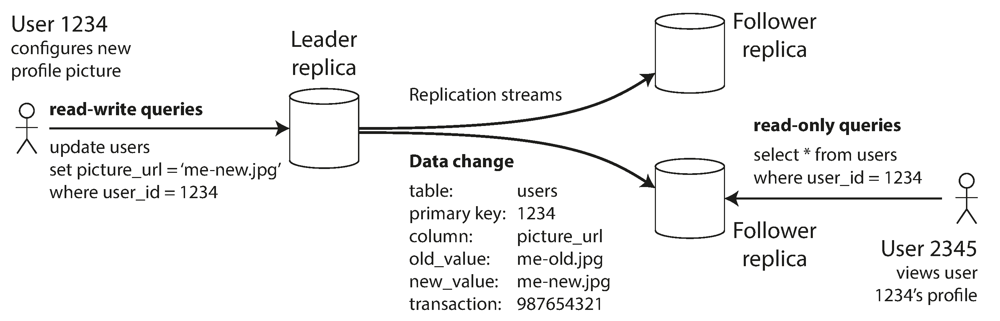

### Synchronous Versus Asynchronous Replication

An important detail of a replicated system is whether the replication happens syn‐
chronously or asynchronously.

Think about what happens in Figure 5-1, where the user of a website updates their
profile image.

Figure 5-2 shows the communication between various components of the system: the
user’s client, the leader, and two followers.

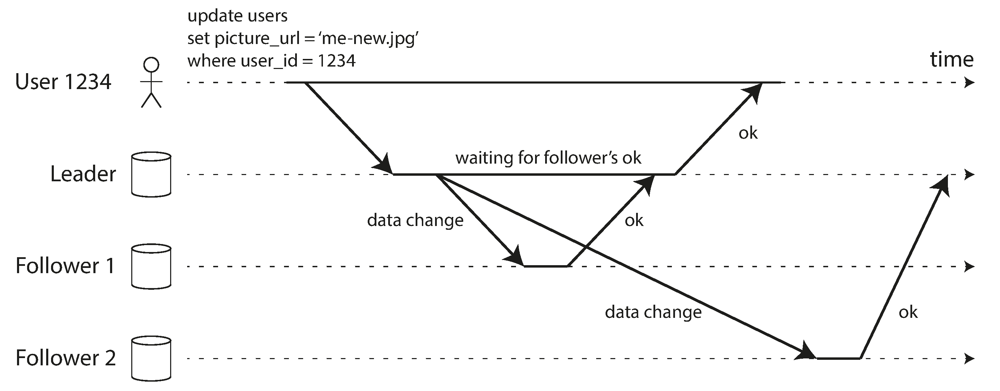

In the example of Figure 5-2, the replication to follower 1 is synchronous: the leader
waits until follower 1 has confirmed that it received the write before reporting success
to the user, and before making the write visible to other clients. The replication to
follower 2 is asynchronous: the leader sends the message, but doesn’t wait for a
response from the follower.

The advantage of synchronous replication is that the follower is guaranteed to have
an up-to-date copy of the data that is consistent with the leader. If the leader sud‐
denly fails, we can be sure that the data is still available on the follower. The disad‐
vantage is that if the synchronous follower doesn’t respond (because it has crashed,
or there is a network fault, or for any other reason), the write cannot be processed.
The leader must block all writes and wait until the synchronous replica is available
again.

### Setting Up New Followers

From time to time, you need to set up new followers—perhaps to increase the num‐
ber of replicas, or to replace failed nodes. How do you ensure that the new follower
has an accurate copy of the leader’s data?

* Take a consistent snapshot of the leader’s database at some point in time—if pos‐
sible, without taking a lock on the entire database.
* Copy the snapshot to the new follower node. 
* The follower connects to the leader and requests all the data changes that have
happened since the snapshot was taken.
* When the follower has processed the backlog of data changes since the snapshot,
we say it has caught up

## Handling Node Outages

Any node in the system can go down, perhaps unexpectedly due to a fault, but just as
likely due to planned maintenance (for example, rebooting a machine to install a ker‐
nel security patch).

### Follower failure: Catch-up recovery

On its local disk, each follower keeps a log of the data changes it has received from
the leader. If a follower crashes and is restarted, or if the network between the leader
and the follower is temporarily interrupted, the follower can recover quite easily:
from its log, it knows the last transaction that was processed before the fault occur‐
red.

### Leader failure: Failover

Handling a failure of the leader is trickier: one of the followers needs to be promoted
to be the new leader, clients need to be reconfigured to send their writes to the new
leader, and the other followers need to start consuming data changes from the new
leader. This process is called failover.

* Determining that the leader has failed.
* Choosing a new leader.
* Reconfiguring the system to use the new leader.

Failover is fraught with things that can go wrong:

* If asynchronous replication is used, the new leader may not have received all the
writes from the old leader before it failed.
* Discarding writes is especially dangerous if other storage systems outside of the
database need to be coordinated with the database contents.
* In certain fault scenarios (see Chapter 8), it could happen that two nodes both
believe that they are the leader.
* What is the right timeout before the leader is declared dead? A longer timeout
means a longer time to recovery in the case where the leader fails. However, if the
timeout is too short, there could be unnecessary failovers.

## Problems with Replication Lag

Being able to tolerate node failures is just one reason for wanting replication. As
mentioned in the introduction to Part II, other reasons are scalability (processing
more requests than a single machine can handle) and latency (placing replicas geo‐
graphically closer to users).

In this read-scaling architecture, you can increase the capacity for serving read-only
requests simply by adding more followers.

Unfortunately, if an application reads from an asynchronous follower, it may see out‐
dated information if the follower has fallen behind. This leads to apparent inconsis‐
tencies in the database: if you run the same query on the leader and a follower at the
same time, you may get different results, because not all writes have been reflected in
the follower

### Reading Your Own Writes

Figure 5-3. A user makes a write, followed by a read from a stale replica. To prevent
this anomaly, we need read-after-write consistency.

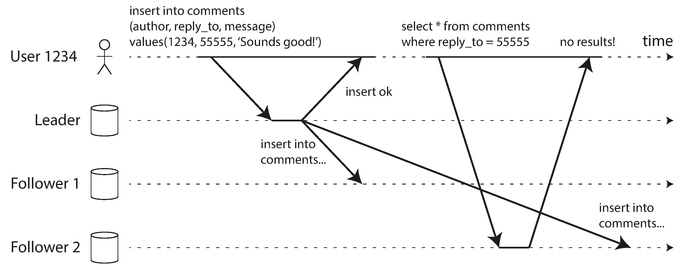

In this situation, we need read-after-write consistency, also known as read-your-writes
consistency [24]. This is a guarantee that if the user reloads the page, they will always
see any updates they submitted themselves.

### Monotonic Reads

Our second example of an anomaly that can occur when reading from asynchronous
followers is that it’s possible for a user to see things moving backward in time.

This can happen if a user makes several reads from different replicas.

For example,
Figure 5-4 shows user 2345 making the same query twice, first to a follower with little
lag, then to a follower with greater lag.

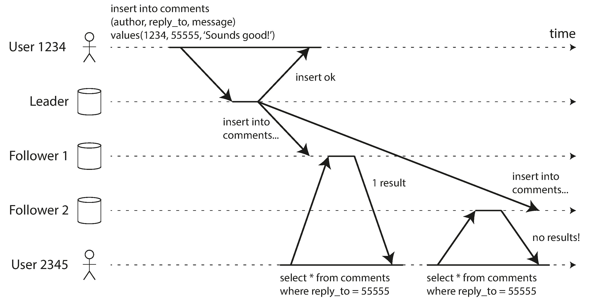

Figure 5-4. A user first reads from a fresh replica, then from a stale replica. Time
appears to go backward. To prevent this anomaly, we need monotonic reads.

One way of achieving monotonic reads is to make sure that each user always makes
their reads from the same replica

### Consistent Prefix Reads

Our third example of replication lag anomalies concerns violation of causality. Imagine 
the following short dialog between Mr. Poons and Mrs. Cake:
Mr. Poons
How far into the future can you see, Mrs. Cake?
Mrs. Cake
About ten seconds usually, Mr. Poons.

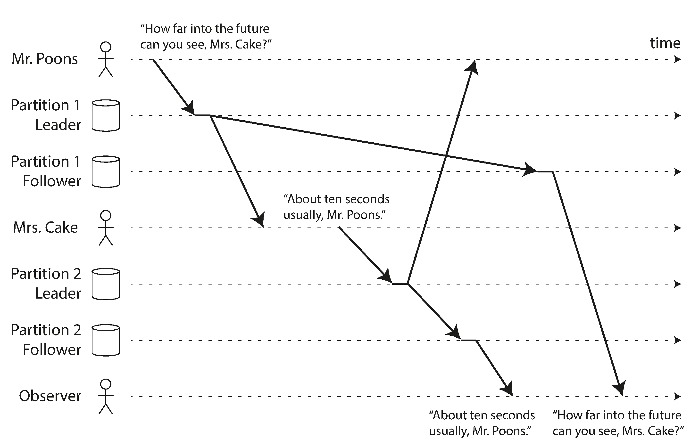

Figure 5-5. If some partitions are replicated slower than others, an observer may see the
answer before they see the question.

Preventing this kind of anomaly requires another type of guarantee: consistent prefix
reads [23]. This guarantee says that if a sequence of writes happens in a certain order,
then anyone reading those writes will see them appear in the same order.

One solution is to make sure that any writes that are causally related to each other are
written to the same partition—but in some applications that cannot be done effi‐
ciently.

## Multi-Leader Replication

So far in this chapter we have only considered replication architectures using a single
leader. Although that is a common approach, there are interesting alternatives.
Leader-based replication has one major downside: there is only one leader, and all
writes must go through it. iv If you can’t connect to the leader for any reason, for
example due to a network interruption between you and the leader, you can’t write to
the database.

A natural extension of the leader-based replication model is to allow more than one
node to accept writes. Replication still happens in the same way: each node that pro‐
cesses a write must forward that data change to all the other nodes. We call this a
multi-leader configuration (also known as master–master or active/active replication).
In this setup, each leader simultaneously acts as a follower to the other leaders.

### Use Cases for Multi-Leader Replication

It rarely makes sense to use a multi-leader setup within a single datacenter

#### Multi-datacenter operation

In a multi-leader configuration, you can have a leader in each datacenter. Figure 5-6
shows what this architecture might look like. Within each datacenter, regular leader–
follower replication is used; between datacenters, each datacenter’s leader replicates
its changes to the leaders in other datacenters.

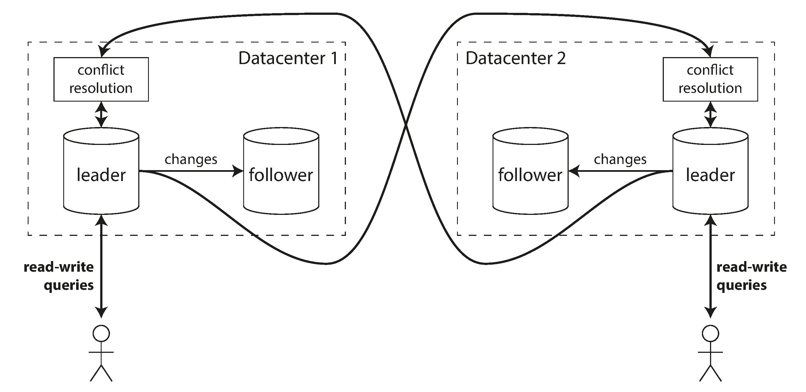

Figure 5-6. Multi-leader replication across multiple datacenters.

Let’s compare how the single-leader and multi-leader configurations fare in a multi-
datacenter deployment:

* Performance
In a single-leader configuration, every write must go over the internet to the
datacenter with the leader. This can add significant latency to writes.
In a multi-leader configuration, every write can be processed in the local datacenter
and is replicated asynchronously to the other datacenters

* Tolerance of datacenter outages
In a single-leader configuration, if the datacenter with the leader fails, failover
can promote a follower in another datacenter to be leader. In a multi-leader con‐
figuration, each datacenter can continue operating independently of the others,
and replication catches up when the failed datacenter comes back online.

#### Clients with offline operation

Another situation in which multi-leader replication is appropriate is if you have an
application that needs to continue to work while it is disconnected from the internet.

For example, consider the calendar apps on your mobile phone, your laptop, and
other devices. You need to be able to see your meetings (make read requests) and
enter new meetings (make write requests) at any time, regardless of whether your
device currently has an internet connection. If you make any changes while you are
offline, they need to be synced with a server and your other devices when the device
is next online.

In this case, every device has a local database that acts as a leader (it accepts write
requests), and there is an asynchronous multi-leader replication process (sync)
between the replicas of your calendar on all of your devices. The replication lag may
be hours or even days, depending on when you have internet access available.

#### Collaborative editing

Real-time collaborative editing applications allow several people to edit a document
simultaneously.

### Handling Write Conflicts

The biggest problem with multi-leader replication is that write conflicts can occur,
which means that conflict resolution is required.

For example, consider a wiki page that is simultaneously being edited by two users, as
shown in Figure 5-7. User 1 changes the title of the page from A to B, and user 2
changes the title from A to C at the same time. Each user’s change is successfully
applied to their local leader. However, when the changes are asynchronously replica‐
ted, a conflict is detected [33]. This problem does not occur in a single-leader data‐
base.

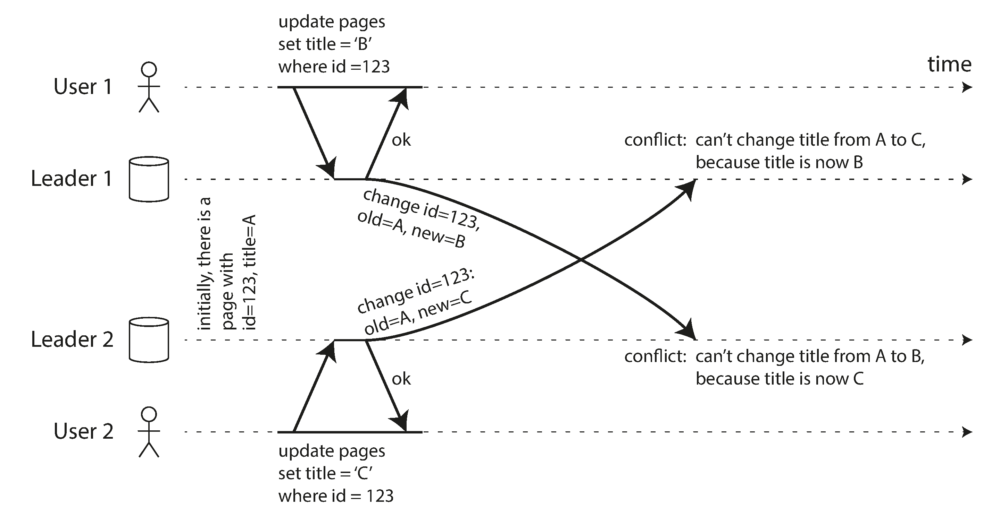

Figure 5-7. A write conflict caused by two leaders concurrently updating the same
record.

#### Synchronous versus asynchronous conflict detection

In a multi-leader setup, both writes are successful, and the
conflict is only detected asynchronously at some later point in time. At that time, it
may be too late to ask the user to resolve the conflict.

In principle, you could make the conflict detection synchronous—i.e., wait for the
write to be replicated to all replicas before telling the user that the write was success‐
ful. However, by doing so, you would lose the main advantage of multi-leader repli‐
cation: allowing each replica to accept writes independently.

#### Conflict avoidance

The simplest strategy for dealing with conflicts is to avoid them: if the application can
ensure that all writes for a particular record go through the same leader, then con‐
flicts cannot occur. Since many implementations of multi-leader replication handle
conflicts quite poorly, avoiding conflicts is a frequently recommended approach.

#### Converging toward a consistent state

In a multi-leader configuration, there is no defined ordering of writes, so it’s not clear
what the final value should be. In Figure 5-7, at leader 1 the title is first updated to B
and then to C; at leader 2 it is first updated to C and then to B. Neither order is “more
correct” than the other.

There are various ways of achieving convergent conflict resolution:

* Give each write a unique ID and pick the write with the highest ID as the winner.
* Give each replica a unique ID, and let writes that originated at a higher-
numbered replica always take precedence over writes that originated at a lower-
numbered replica.
* Somehow merge the values together. order them alphabetically and then
concatenate them (“B/C”)
* Record the conflict in an explicit data structure that preserves all information,
and write application code that resolves the conflict at some later time (perhaps
by prompting the user).

### Multi-Leader Replication Topologies

A replication topology describes the communication paths along which writes are
propagated from one node to another. If you have two leaders, like in Figure 5-7,
there is only one plausible topology: leader 1 must send all of its writes to leader 2,
and vice versa. With more than two leaders, various different topologies are possible.
Some examples are illustrated in Figure 5-8.

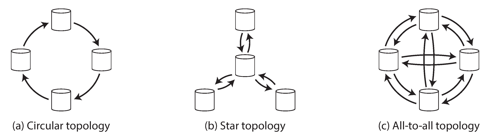

Figure 5-8. Three example topologies in which multi-leader replication can be set up.

The most general topology is all-to-all (Figure 5-8 [c]), in which every leader sends its
writes to every other leader.

all-to-all topologies can have issues too. In particular, some net‐
work links may be faster than others (e.g., due to network congestion), with the result
that some replication messages may “overtake” others, as illustrated in Figure 5-9.

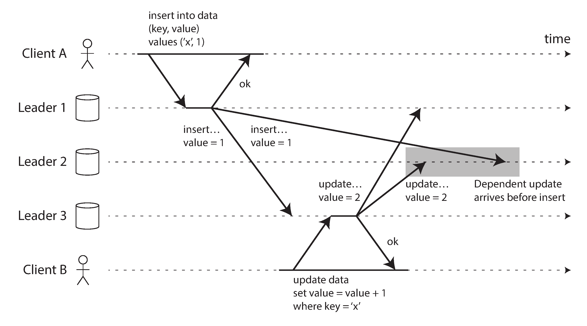

Figure 5-9. With multi-leader replication, writes may arrive in the wrong order at some
replicas.

## Leaderless Replication

The replication approaches we have discussed so far in this chapter—single-leader
and multi-leader replication—are based on the idea that a client sends a write request
to one node (the leader), and the database system takes care of copying that write to
the other replicas. A leader determines the order in which writes should be processed,
and followers apply the leader’s writes in the same order.

In some leaderless implementations, the client directly sends its writes to several rep‐
licas.

### Writing to the Database When a Node Is Down

Imagine you have a database with three replicas, and one of the replicas is currently
unavailable.

On the other hand, in a leaderless configuration, failover does not exist. Figure 5-10
shows what happens.

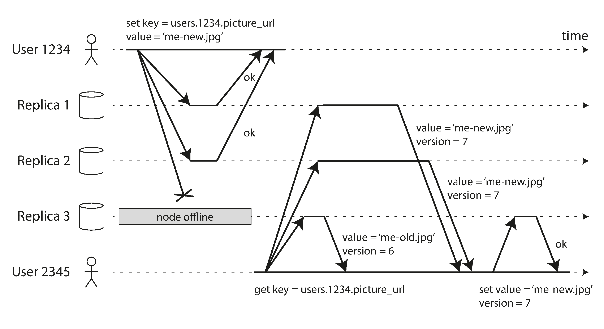

Figure 5-10. A quorum write, quorum read, and read repair after a node outage.

Now imagine that the unavailable node comes back online, and clients start reading
from it. Any writes that happened while the node was down are missing from that
node. Thus, if you read from that node, you may get stale (outdated) values as
responses.

To solve that problem, when a client reads from the database, it doesn’t just send its
request to one replica: read requests are also sent to several nodes in parallel. The cli‐
ent may get different responses from different nodes; i.e., the up-to-date value from
one node and a stale value from another

#### Read repair and anti-entropy

The replication scheme should ensure that eventually all the data is copied to every
replica. After an unavailable node comes back online, how does it catch up on the
writes that it missed?

* Read repair
When a client makes a read from several nodes in parallel, it can detect any stale
responses. For example, in Figure 5-10, user 2345 gets a version 6 value from rep‐
lica 3 and a version 7 value from replicas 1 and 2. The client sees that replica 3
has a stale value and writes the newer value back to that replica. This approach
works well for values that are frequently read.

* Anti-entropy process
In addition, some datastores have a background process that constantly looks for
differences in the data between replicas and copies any missing data from one
replica to another

#### Quorums for reading and writing

The quorum condition, w + r > n, allows the system to tolerate unavailable nodes as
follows:

* If w < n, we can still process writes if a node is unavailable.
* If r < n, we can still process reads if a node is unavailable.
* With n = 3, w = 2, r = 2 we can tolerate one unavailable node.
* With n = 5, w = 3, r = 3 we can tolerate two unavailable nodes. This case is illus‐
trated in Figure 5-11.
* Normally, reads and writes are always sent to all n replicas in parallel. The
parameters w and r determine how many nodes we wait for—i.e., how many of
the n nodes need to report success before we consider the read or write to be suc‐
cessful.

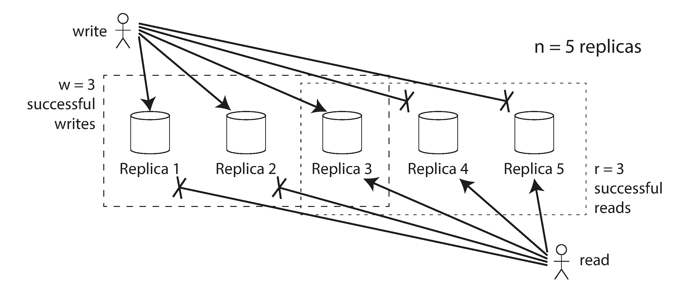

Figure 5-11. If w + r > n, at least one of the r replicas you read from must have seen the
most recent successful write.

