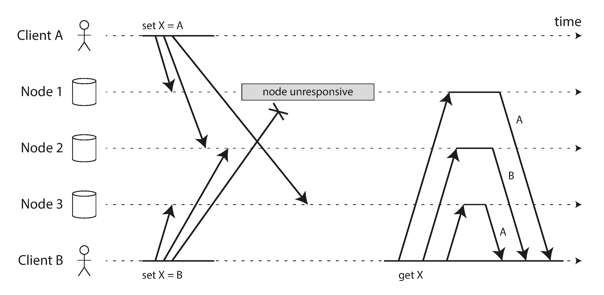

# Chapter 5 - Replication

Why you might want to replicate data

* To keep data geographically close to your users (and thus reduce latency)
* To allow the system to continue working even if some of its parts have failed
(and thus increase availability)
* To scale out the number of machines that can serve read queries (and thus
increase read throughput)

If the data that you’re replicating does not change over time, then replication is easy:
you just need to copy the data to every node once, and you’re done. All of the diffi‐
culty in replication lies in handling changes to replicated data, and that’s what this
chapter is about.

We will discuss three popular algorithms for replicating changes
between nodes: single-leader, multi-leader, and leaderless replication

## Leaders and Followers

Each node that stores a copy of the database is called a replica. With multiple replicas,
a question inevitably arises: how do we ensure that all the data ends up on all the rep‐
licas? (Figure 5-1)

* One of the replicas is designated the leader

* The other replicas are known as followers. Whenever the leader writes new data to its local storage, it also sends
the data change to all of its followers as part of a replication log or change stream.

* When a client wants to read from the database, it can query either the leader or
any of the followers

### Synchronous Versus Asynchronous Replication

An important detail of a replicated system is whether the replication happens syn‐
chronously or asynchronously.

Think about what happens in Figure 5-1, where the user of a website updates their
profile image.

Figure 5-2 shows the communication between various components of the system: the
user’s client, the leader, and two followers.

In the example of Figure 5-2, the replication to follower 1 is synchronous: the leader
waits until follower 1 has confirmed that it received the write before reporting success
to the user, and before making the write visible to other clients. The replication to
follower 2 is asynchronous: the leader sends the message, but doesn’t wait for a
response from the follower.

The advantage of synchronous replication is that the follower is guaranteed to have
an up-to-date copy of the data that is consistent with the leader. If the leader sud‐
denly fails, we can be sure that the data is still available on the follower. The disad‐
vantage is that if the synchronous follower doesn’t respond (because it has crashed,
or there is a network fault, or for any other reason), the write cannot be processed.
The leader must block all writes and wait until the synchronous replica is available
again.

### Setting Up New Followers

From time to time, you need to set up new followers—perhaps to increase the num‐
ber of replicas, or to replace failed nodes. How do you ensure that the new follower
has an accurate copy of the leader’s data?

* Take a consistent snapshot of the leader’s database at some point in time—if pos‐
sible, without taking a lock on the entire database.
* Copy the snapshot to the new follower node. 
* The follower connects to the leader and requests all the data changes that have
happened since the snapshot was taken.
* When the follower has processed the backlog of data changes since the snapshot,
we say it has caught up

## Handling Node Outages

Any node in the system can go down, perhaps unexpectedly due to a fault, but just as
likely due to planned maintenance (for example, rebooting a machine to install a ker‐
nel security patch).

### Follower failure: Catch-up recovery

On its local disk, each follower keeps a log of the data changes it has received from
the leader. If a follower crashes and is restarted, or if the network between the leader
and the follower is temporarily interrupted, the follower can recover quite easily:
from its log, it knows the last transaction that was processed before the fault occur‐
red.

### Leader failure: Failover

Handling a failure of the leader is trickier: one of the followers needs to be promoted
to be the new leader, clients need to be reconfigured to send their writes to the new
leader, and the other followers need to start consuming data changes from the new
leader. This process is called failover.

* Determining that the leader has failed.
* Choosing a new leader.
* Reconfiguring the system to use the new leader.

Failover is fraught with things that can go wrong:

* If asynchronous replication is used, the new leader may not have received all the
writes from the old leader before it failed.
* Discarding writes is especially dangerous if other storage systems outside of the
database need to be coordinated with the database contents.
* In certain fault scenarios (see Chapter 8), it could happen that two nodes both
believe that they are the leader.
* What is the right timeout before the leader is declared dead? A longer timeout
means a longer time to recovery in the case where the leader fails. However, if the
timeout is too short, there could be unnecessary failovers.

## Problems with Replication Lag

Being able to tolerate node failures is just one reason for wanting replication. As
mentioned in the introduction to Part II, other reasons are scalability (processing
more requests than a single machine can handle) and latency (placing replicas geo‐
graphically closer to users).

In this read-scaling architecture, you can increase the capacity for serving read-only
requests simply by adding more followers.

Unfortunately, if an application reads from an asynchronous follower, it may see out‐
dated information if the follower has fallen behind. This leads to apparent inconsis‐
tencies in the database: if you run the same query on the leader and a follower at the
same time, you may get different results, because not all writes have been reflected in
the follower

### Reading Your Own Writes

Figure 5-3. A user makes a write, followed by a read from a stale replica. To prevent
this anomaly, we need read-after-write consistency.

In this situation, we need read-after-write consistency, also known as read-your-writes
consistency [24]. This is a guarantee that if the user reloads the page, they will always
see any updates they submitted themselves.

### Monotonic Reads

Our second example of an anomaly that can occur when reading from asynchronous
followers is that it’s possible for a user to see things moving backward in time.

This can happen if a user makes several reads from different replicas.

For example,
Figure 5-4 shows user 2345 making the same query twice, first to a follower with little
lag, then to a follower with greater lag.

Figure 5-4. A user first reads from a fresh replica, then from a stale replica. Time
appears to go backward. To prevent this anomaly, we need monotonic reads.

One way of achieving monotonic reads is to make sure that each user always makes
their reads from the same replica

### Consistent Prefix Reads

Our third example of replication lag anomalies concerns violation of causality. Imagine 
the following short dialog between Mr. Poons and Mrs. Cake:
Mr. Poons
How far into the future can you see, Mrs. Cake?
Mrs. Cake
About ten seconds usually, Mr. Poons.

Figure 5-5. If some partitions are replicated slower than others, an observer may see the
answer before they see the question.

Preventing this kind of anomaly requires another type of guarantee: consistent prefix
reads [23]. This guarantee says that if a sequence of writes happens in a certain order,
then anyone reading those writes will see them appear in the same order.

One solution is to make sure that any writes that are causally related to each other are
written to the same partition—but in some applications that cannot be done effi‐
ciently.

## Multi-Leader Replication

## Leaderless Replication

