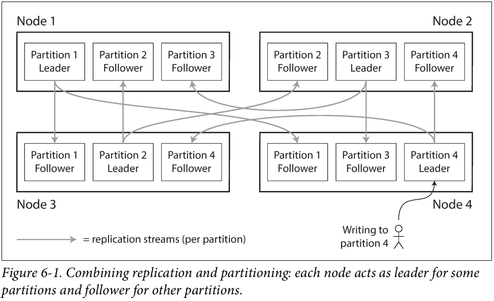
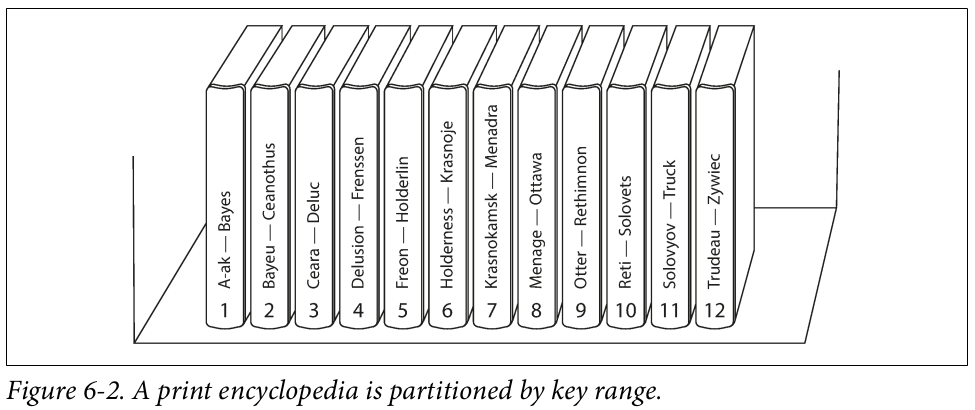
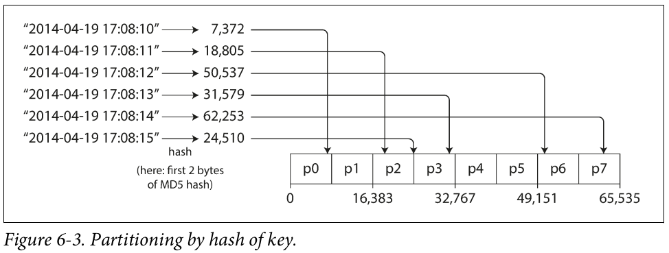
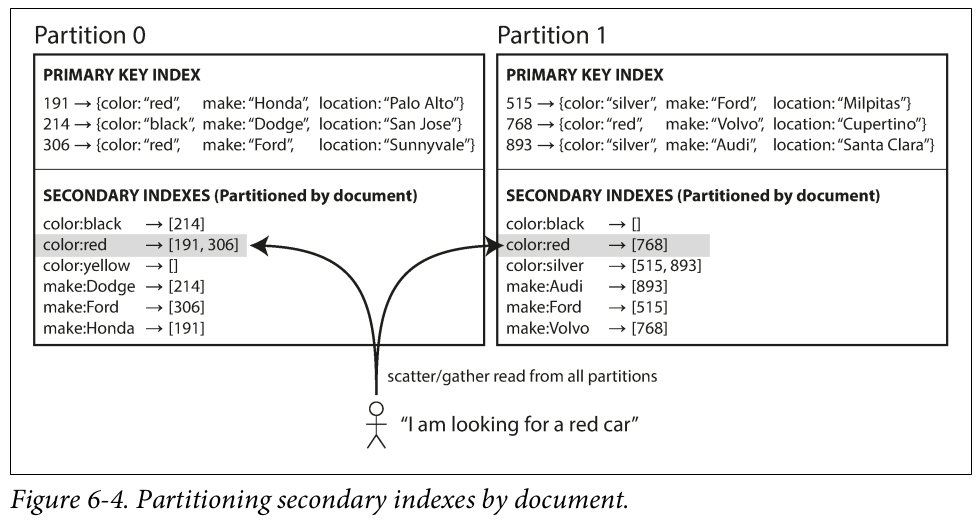
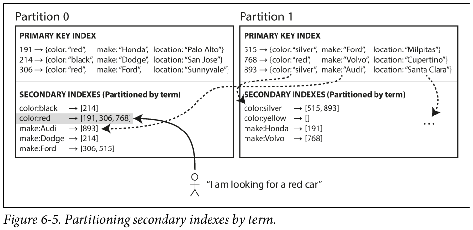

# Chapter 6 - Partitioning

In Chapter 5 we discussed replication—that is, having multiple copies of the same data on different nodes. For very large datasets, or very high query throughput, that is not sufficient: we need to break the data up into partitions, also known as sharding.

```
Terminological confusion

What we call a partition here is called a shard in MongoDB, Elasticsearch, and SolrCloud; it’s known as a region in HBase, a tablet in Bigtable, a vnode in Cassandra and Riak, and a vBucket in Couchbase. However, partitioning is the most established term, so
we’ll stick with that.
```

Normally, partitions are defined in such a way that each piece of data (each record, row, or document) belongs to exactly one partition. There are various ways of achieving this, which we discuss in depth in this chapter. In effect, each partition is a small database of its own, although the database may support operations that touch multiple partitions at the same time.


The main reason for wanting to partition data is scalability. 

Partitioned databases were pioneered in the 1980s by products such as Teradata and Tandem NonStop SQL, and more recently rediscovered by NoSQL databases and Hadoop-based data warehouses.

In this chapter we will first look at different approaches for partitioning large datasets and observe how the indexing of data interacts with partitioning. We’ll then talk about rebalancing, which is necessary if you want to add or remove nodes in your cluster. Finally, we’ll get an overview of how databases route requests to the right partitions and execute queries.

## Partitioning and Replication

Partitioning is usually combined with replication so that copies of each partition are stored on multiple nodes. This means that, even though each record belongs to exactly one partition, it may still be stored on several different nodes for fault tolerance.

A node may store more than one partition. If a leader–follower replication model is used, the combination of partitioning and replication can look like below Figure. Each partition’s leader is assigned to one node, and its followers are assigned to other nodes. Each node may be the leader for some partitions and a follower for other partitions.



## Partitioning of Key-Value Data

Our goal with partitioning is to spread the data and the query load evenly across nodes. If every node takes a fair share, then—in theory—10 nodes should be able to handle 10 times as much data and 10 times the read and write throughput of a single node (ignoring replication for now).

If the partitioning is unfair, so that some partitions have more data or queries than others, we call it skewed. The presence of skew makes partitioning much less effective. In an extreme case, all the load could end up on one partition, so 9 out of 10 nodes are idle and your bottleneck is the single busy node. A partition with disproportionately high load is called a hot spot.

The simplest approach for avoiding hot spots would be to assign records to nodes randomly. That would distribute the data quite evenly across the nodes, but it has a big disadvantage: when you’re trying to read a particular item, you have no way of knowing which node it is on, so you have to query all nodes in parallel.

We can do better. Let’s assume for now that you have a simple key-value data model, in which you always access a record by its primary key. For example, in an old-fashioned paper encyclopedia, you look up an entry by its title; since all the entries are alphabetically sorted by title, you can quickly find the one you’re looking for.

###  Partitioning by Key Range

One way of partitioning is to assign a continuous range of keys (from some minimum to some maximum) to each partition, like the volumes of a paper encyclopedia. If you know the boundaries between the ranges, you can easily determine which partition contains a given key. If you also know which partition is assigned to which node, then you can make your request directly to the appropriate node (or, in the case of the encyclopedia, pick the correct book off the shelf).



The ranges of keys are not necessarily evenly spaced, because your data may not be evenly distributed. For example, in Figure 6-2, volume 1 contains words starting with A and B, but volume 12 contains words starting with T, U, V, X, Y, and Z. Simply having one volume per two letters of the alphabet would lead to some volumes being much bigger than others. In order to distribute the data evenly, the partition boundaries need to adapt to the data.

However, the downside of key range partitioning is that certain access patterns can lead to hot spots. If the key is a timestamp, then the partitions correspond to ranges of time—e.g., one partition per day. Unfortunately, because we write data from the sensors to the database as the measurements happen, all the writes end up going to the same partition (the one for today), so that partition can be overloaded with writes while others sit idle [5].

To avoid this problem in the sensor database, you need to use something other than the timestamp as the first element of the key. For example, you could prefix each timestamp with the sensor name so that the partitioning is first by sensor name and then by time. Assuming you have many sensors active at the same time, the write load will end up more evenly spread across the partitions.

###  Partitioning by Hash of Key

Because of this risk of skew and hot spots, many distributed datastores use a hash function to determine the partition for a given key.

A good hash function takes skewed data and makes it uniformly distributed. Say you have a 32-bit hash function that takes a string. Whenever you give it a new string, it returns a seemingly random number between 0 and 2 32 − 1. Even if the input strings are very similar, their hashes are evenly distributed across that range of numbers.

For partitioning purposes, the hash function need not be cryptographically strong: for example, Cassandra and MongoDB use MD5, and Voldemort uses the Fowler–Noll–Vo function. 

Once you have a suitable hash function for keys, you can assign each partition a range of hashes (rather than a range of keys), and every key whose hash falls within a partition’s range will be stored in that partition. This is illustrated in Figure 6-3.



Unfortunately however, by using the hash of the key for partitioning we lose a nice property of key-range partitioning: the ability to do efficient range queries. Keys that were once adjacent are now scattered across all the partitions, so their sort order is lost. In MongoDB, if you have enabled hash-based sharding mode, any range query has to be sent to all partitions [4].

Cassandra achieves a compromise between the two partitioning strategies [11, 12,13]. A table in Cassandra can be declared with a compound primary key consisting of several columns. Only the first part of that key is hashed to determine the partition, but the other columns are used as a concatenated index for sorting the data in Cassandra’s SSTables.

### Skewed Workloads and Relieving Hot Spots

As discussed, hashing a key to determine its partition can help reduce hot spots. However, it can’t avoid them entirely: in the extreme case where all reads and writes are for the same key, you still end up with all requests being routed to the same partition.

This kind of workload is perhaps unusual, but not unheard of: for example, on a social media site, a celebrity user with millions of followers may cause a storm of activity when they do something [14]. This event can result in a large volume of writes to the same key (where the key is perhaps the user ID of the celebrity, or the ID of the action that people are commenting on). Hashing the key doesn’t help, as the hash of two identical IDs is still the same.

Today, most data systems are not able to automatically compensate for such a highly skewed workload, so it’s the responsibility of the application to reduce the skew. For example, if one key is known to be very hot, a simple technique is to add a random number to the beginning or end of the key. Just a two-digit decimal random number would split the writes to the key evenly across 100 different keys, allowing those keys to be distributed to different partitions.

However, having split the writes across different keys, any reads now have to do additional work, as they have to read the data from all 100 keys and combine it. This technique also requires additional bookkeeping: it only makes sense to append the random number for the small number of hot keys; for the vast majority of keys with low write throughput this would be unnecessary overhead. Thus, you also need some way of keeping track of which keys are being split.

## Partitioning and Secondary Indexes

The partitioning schemes we have discussed so far rely on a key-value data model. If records are only ever accessed via their primary key, we can determine the partition from that key and use it to route read and write requests to the partition responsible for that key.

The situation becomes more complicated if secondary indexes are involved. A secondary index usually doesn’t identify a record uniquely but rather is a way of searching for occurrences of a particular value: find all actions by user 123 , find all articles containing the word hogwash , find all cars whose color is red , and so on.

Secondary indexes are the raison d’être of search servers such as Solr and Elasticsearch.

The problem with secondary indexes is that they don’t map neatly to partitions. There are two main approaches to partitioning a database with secondary indexes: document-based partitioning and term-based partitioning.

### Partitioning Secondary Indexes by Document

For example, imagine you are operating a website for selling used cars (illustrated in Figure 6-4). Each listing has a unique ID—call it the document ID—and you partition the database by the document ID (for example, IDs 0 to 499 in partition 0, IDs 500 to 999 in partition 1, etc.).

You want to let users search for cars, allowing them to filter by color and by make, so you need a secondary index on color and make (in a document database these would be fields; in a relational database they would be columns). If you have declared the index, the database can perform the indexing automatically. ii For example, whenever a red car is added to the database, the database partition automatically adds it to the list of document IDs for the index entry color:red .



In this indexing approach, each partition is completely separate: each partition maintains its own secondary indexes, covering only the documents in that partition. It doesn’t care what data is stored in other partitions. Whenever you need to write to the database—to add, remove, or update a document—you only need to deal with the partition that contains the document ID that you are writing. For that reason, a document-partitioned index is also known as a local index (as opposed to a global index, described in the next section).

However, reading from a document-partitioned index requires care: unless you have done something special with the document IDs, there is no reason why all the cars with a particular color or a particular make would be in the same partition. In Figure 6-4, red cars appear in both partition 0 and partition 1. Thus, if you want to search for red cars, you need to send the query to all partitions, and combine all the results you get back.

This approach can make read queries on secondary indexes quite expensive.

This approach to querying a partitioned database is sometimes known as scatter/gather, and it can make read queries on secondary indexes quite expensive. Even if you query the partitions in parallel, scatter/gather is prone to tail latency amplification. Nevertheless, it is widely used: MongoDB, Riak [15], Cassandra [16], Elasticsearch [17], SolrCloud [18], and VoltDB [19] all use document-partitioned secondary indexes. Most database vendors recommend that you structure your partitioning scheme so that secondary index queries can be served from a single partition, but that is not always possible, especially when you’re using multiple secondary indexes in a single query (such as filtering cars by color and by make at the same time).

### Partitioning Secondary Indexes by Term

Rather than each partition having its own secondary index (a local index), we can construct a global index that covers data in all partitions. However, we can’t just store that index on one node, since it would likely become a bottleneck and defeat the purpose of partitioning. A global index must also be partitioned, but it can be partitioned differently from the primary key index.


