# Chapter 6 - Partitioning

In the harsh reality of data systems, many things can go wrong:
- The database software or hardware may fail at any time (including in the middle of a write operation).
- The application may crash at any time (including halfway through a series of operations).
- Interruptions in the network can unexpectedly cut off the application from the database, or one database node from another.
- Several clients may write to the database at the same time, overwriting each other’s changes.
- A client may read data that doesn’t make sense because it has only partially been updated.
- Race conditions between clients can cause surprising bugs.

A transaction is a way for an application to group several reads and writes together into a logical unit. Conceptually, all the reads and writes in a transaction are executed as one operation: either the entire transaction succeeds (commit) or it fails (abort, rollback). If it fails, the application can safely retry. With transactions, error handling becomes much simpler for an application, because it doesn’t need to worry about partial failure, the case where some operations succeed and some fail (for whatever reason).

## The Slippery Concept of a Transaction

Almost all relational databases today, and some nonrelational databases, support transactions. Most of them follow the style that was introduced in 1975 by **IBM System R**, the first SQL database. Although some implementation details have changed, the general idea has remained virtually the same for 40 years: the transaction support in **MySQL**, **PostgreSQL**, **Oracle**, **SQL Server**, etc., is uncannily similar to that of System R.

With the hype around this new crop of distributed databases, there emerged a popular belief that transactions were the antithesis of scalability, and that any large-scale system would have to abandon transactions in order to maintain good performance and high availability. On the other hand, transactional guarantees are sometimes presented by database vendors as an essential requirement for “serious applications” with “valuable data.” Both viewpoints are pure hyperbole.

## The Meaning of ACID

The safety guarantees provided by transactions are often described by the wellknown acronym **ACID**, which stands for *Atomicity*, *Consistency*, *Isolation*, and *Durability*. It was coined in 1983 by Theo Härder and Andreas Reuter in an effort to establish precise terminology for fault-tolerance mechanisms in databases.

### Atomicity

ACID atomicity describes what happens if a client wants to make several writes, but a fault occurs after some of the writes have been processed. If the writes are grouped together into an atomic transaction, and the transaction cannot be completed (committed) due to a fault, then the transaction is aborted and the database must discard or undo any writes it has made so far in that transaction.

### Consistency

The idea of ACID consistency is that you have certain statements about your data (invariants) that must always be true—for example, in an accounting system, credits and debits across all accounts must always be balanced. If a transaction starts with a database that is valid according to these invariants, and any writes during the transaction preserve the validity, then you can be sure that the invariants are always satisfied.

### Isolation

Isolation in the sense of ACID means that concurrently executing transactions are isolated from each other: they cannot step on each other’s toes. The classic database textbooks formalize isolation as serializability, which means that each transaction can pretend that it is the only transaction running on the entire database. The database ensures that when the transactions have committed, the result is the same as if they had run serially (one after another), even though in reality they may have run concurrently.

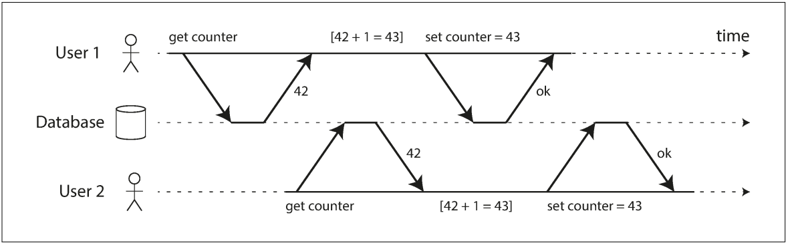

### Durability

In a single-node database, durability typically means that the data has been written to nonvolatile storage such as a hard drive or SSD. It usually also involves a write-ahead log or similar (see “Making B-trees reliable” on page 82), which allows recovery in the event that the data structures on disk are corrupted. In a replicated database, durability may mean that the data has been successfully copied to some number of nodes. In order to provide a durability guarantee, a database must wait until these writes or replications are complete before reporting a transaction as successfully committed.

## Single-Object and Multi-Object Operations

multi-object transactions are often needed if several pieces of data need to be kept in sync. Figure 7-2 shows an example from an email application. To display the number of unread messages for a user, you could query something like:

```sql
SELECT COUNT(*) FROM emails WHERE recipient_id = 2 AND unread_flag = true
```

However, you might find this query to be too slow if there are many emails, and decide to store the number of unread messages in a separate field (a kind of denormalization). Now, whenever a new message comes in, you have to increment the unread counter as well, and whenever a message is marked as read, you also have to decrement the unread counter.

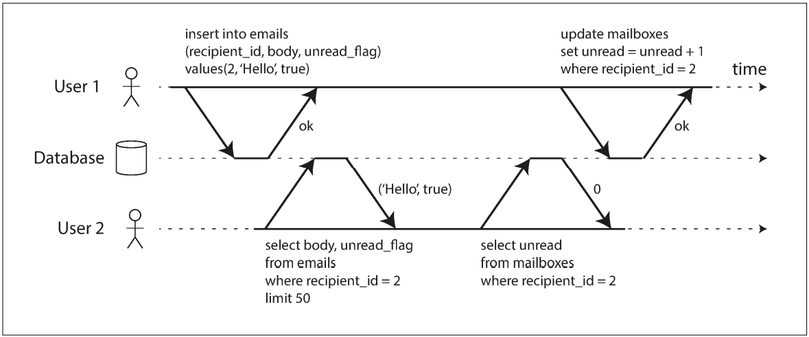

Figure 7-3 illustrates the need for atomicity: if an error occurs somewhere over the course of the transaction, the contents of the mailbox and the unread counter might become out of sync. In an atomic transaction, if the update to the counter fails, the transaction is aborted and the inserted email is rolled back.

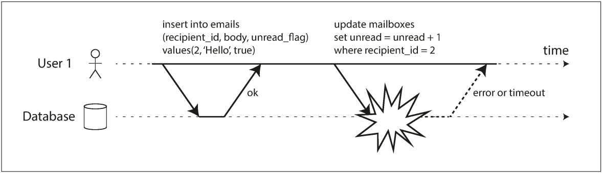

### Single-object writes

Atomicity and isolation also apply when a single object is being changed. Storage engines almost universally aim to provide atomicity and isolation on the level of a single object (such as a keyvalue pair) on one node. Atomicity can be implemented using a log for crash recovery (see “Making B-trees reliable” on page 82), and isolation can be implemented using a lock on each object (allowing only one thread to access an object at any one time).

### Handling errors and aborts

Errors will inevitably happen, but many software developers prefer to think only about the happy path rather than the intricacies of error handling. For example, popular object-relational mapping (ORM) frameworks such as Rails’s ActiveRecord and Django don’t retry aborted transactions, so any user input is thrown away and the user gets an error message. This is a shame, because the whole point of aborts is to enable safe retries.

## Weak Isolation Levels

isolation is unfortunately not that simple. Serializable isolation has a performance cost, and many databases don’t want to pay that price. It’s therefore common for systems to use weaker levels of isolation, which protect against some concurrency issues, but not all. Those levels of isolation are much harder to understand, and they can lead to subtle bugs, but they are nevertheless used in practice.

### Read Committed

The most basic level of transaction isolation is read committed. It makes two guarantees:

1. When reading from the database, you will only see data that has been committed (no dirty reads).
2. When writing to the database, you will only overwrite data that has been committed (no dirty writes).

#### No dirty reads

Transactions running at the read committed isolation level must prevent dirty reads. This means that any writes by a transaction only become visible to others when that transaction commits (and then all of its writes become visible at once.

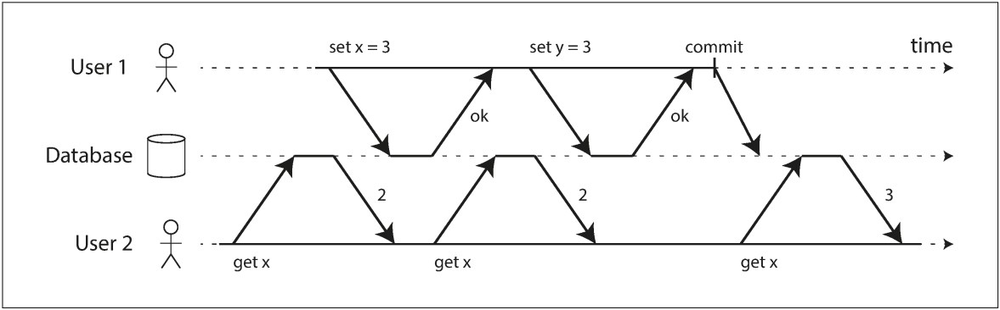

#### No dirty writes

Transactions running at the read committed isolation level must prevent dirty writes, usually by delaying the second write until the first write’s transaction has committed or aborted.

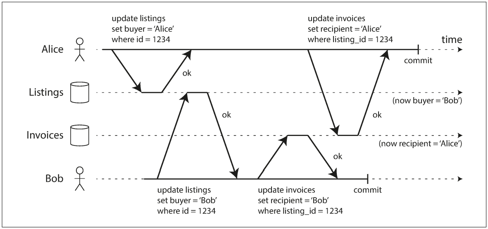

### Snapshot Isolation and Repeatable Read

The idea is that each transaction reads from a consistent snapshot of the database—that is, the transaction sees all the data that was committed in the database at the start of the transaction. Even if the data is subsequently changed by another transaction, each transaction sees only the old data from that particular point in time.

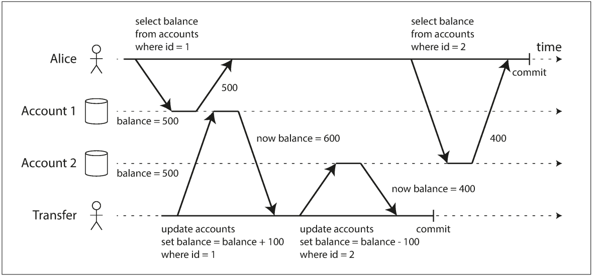

To implement snapshot isolation, databases use a generalization of the mechanism we saw for preventing dirty reads. The database must potentially keep several different committed versions of an object, because various in-progress transactions may need to see the state of the database at different points in time. Because it maintains several versions of an object side by side, this technique is known as multiversion concurrency control (MVCC).

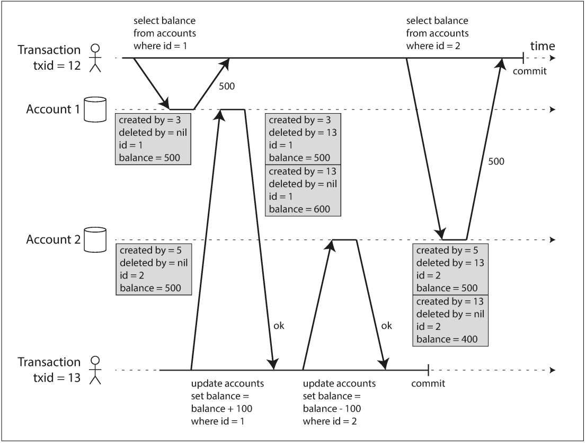

#### Visibility rules for observing a consistent snapshot

the database can present a consistent snapshot of the database to the application. This works as follows:

1. At the start of each transaction, the database makes a list of all the other transactions that are in progress (not yet committed or aborted) at that time. Any writes that those transactions have made are ignored, even if the transactions subsequently commit.
2. Any writes made by aborted transactions are ignored.
3. Any writes made by transactions with a later transaction ID (i.e., which started after the current transaction started) are ignored, regardless of whether those transactions have committed.
4. All other writes are visible to the application’s queries.

### Preventing Lost Updates

The lost update problem can occur if an application reads some value from the database, modifies it, and writes back the modified value (a read-modify-write cycle). If two transactions do this concurrently, one of the modifications can be lost, because the second write does not include the first modification. (We sometimes say that the later write clobbers the earlier write.) 

#### Atomic write operations

Many databases provide atomic update operations, which remove the need to implement read-modify-write cycles in application code. They are usually the best solution if your code can be expressed in terms of those operations. For example, the following instruction is concurrency-safe in most relational databases:

```sql
UPDATE counters SET value = value + 1 WHERE key = 'foo';
```

#### Explicit locking

Another option for preventing lost updates, if the database’s built-in atomic operations don’t provide the necessary functionality, is for the application to explicitly lock objects that are going to be updated. Then the application can perform a readmodify-write cycle, and if any other transaction tries to concurrently read the same object, it is forced to wait until the first read-modify-write cycle has completed.

```sql
BEGIN TRANSACTION;

SELECT * FROM figures
 WHERE name = 'robot' AND game_id = 222
 FOR UPDATE;

-- Check whether move is valid, then update the position
-- of the piece that was returned by the previous SELECT.
UPDATE figures SET position = 'c4' WHERE id = 1234;

COMMIT;
```

#### Compare-and-set

In databases that don’t provide transactions, you sometimes find an atomic compareand-set operation. The purpose of this operation is to avoid lost updates by allowing an update to happen only if the value has not changed since you last read it. If the current value does not
match what you previously read, the update has no effect, and the read-modify-write cycle must be retried.

```sql
-- This may or may not be safe, depending on the database implementation
UPDATE wiki_pages SET content = 'new content' WHERE id = 1234 AND content = 'old content';
```

### Write Skew and Phantoms

In order to avoid data corruption, those race conditions need to be prevented—either automatically by the database, or by manual safeguards such as using locks or atomic write operations.

To begin, imagine this example: you are writing an application for doctors to manage their on-call shifts at a hospital. The hospital usually tries to have several doctors on call at any one time, but it absolutely must have at least one doctor on call. Doctors can give up their shifts (e.g., if they are sick themselves), provided that at least one colleague remains on call in that shift [40, 41].
Now imagine that Alice and Bob are the two on-call doctors for a particular shift. Both are feeling unwell, so they both decide to request leave. Unfortunately, they happen to click the button to go off call at approximately the same time. What happens next is illustrated in Figure 7-8.

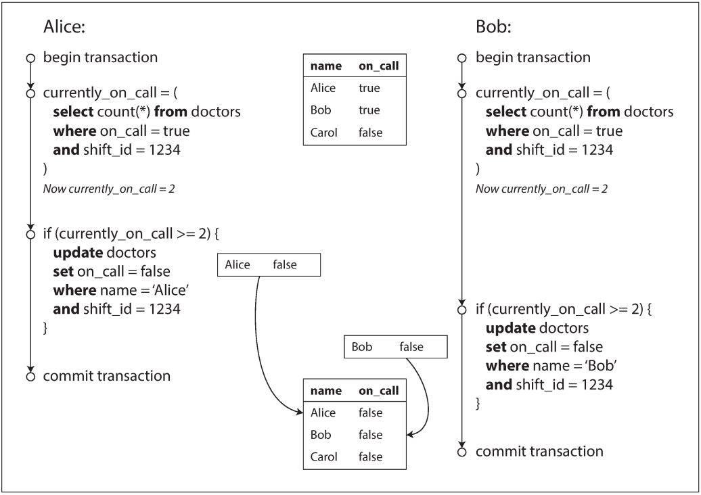

## Serializability

Serializable isolation is usually regarded as the strongest isolation level. It guarantees that even though transactions may execute in parallel, the end result is the same as if they had executed one at a time, serially, without any concurrency. Thus, the database guarantees that if the transactions behave correctly when run individually, they continue to be correct when run concurrently—in other words, the database prevents all possible race conditions.

### Actual Serial Execution

The simplest way of avoiding concurrency problems is to remove the concurrency entirely: to execute only one transaction at a time, in serial order, on a single thread. By doing so, we completely sidestep the problem of detecting and preventing conflicts between transactions: the resulting isolation is by definition serializable.

For this reason, systems with single-threaded serial transaction processing don’t allow interactive multi-statement transactions. Instead, the application must submit the entire transaction code to the database ahead of time, as a stored procedure. The differences between these approaches is illustrated in Figure 7-9. Provided that all data required by a transaction is in memory, the stored procedure can execute very fast, without waiting for any network or disk I/O.

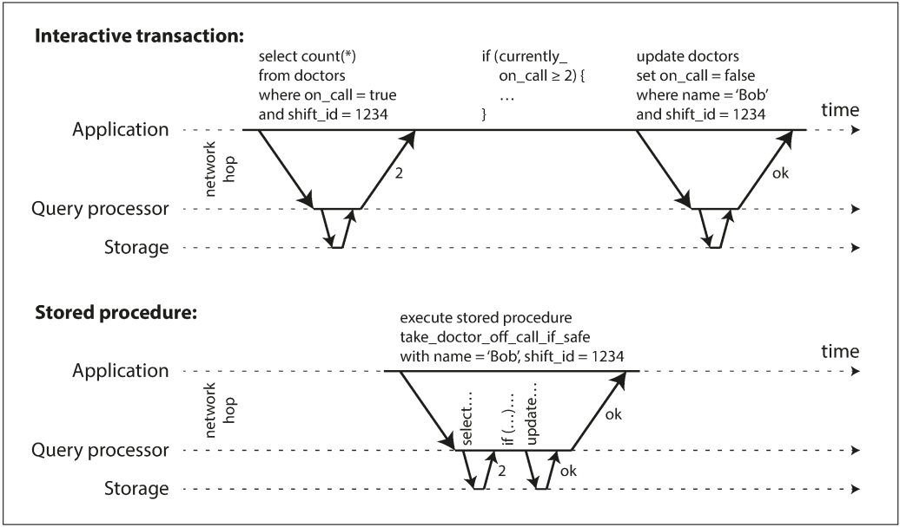

### Two-Phase Locking (2PL)

Two-phase locking is similar, but makes the lock requirements much stronger. Several transactions are allowed to concurrently read the same object as long as nobody is writing to it. But as soon as anyone wants to write (modify or delete) an object, exclusive access is required:
- If transaction A has read an object and transaction B wants to write to that object, B must wait until A commits or aborts before it can continue. (This ensures that B can’t change the object unexpectedly behind A’s back.)
- If transaction A has written an object and transaction B wants to read that object, B must wait until A commits or aborts before it can continue. (Reading an old version of the object, like in Figure 7-1, is not acceptable under 2PL.)

### Serializable Snapshot Isolation (SSI)

Today SSI is used both in single-node databases (the serializable isolation level in PostgreSQL since version 9.1) and distributed databases (FoundationDB uses a similar algorithm). As SSI is so young compared to other concurrency control mechanisms, it is still proving its performance in practice, but it has the possibility of being fast enough to become the new default in the future.

#### Detecting stale MVCC reads

Recall that snapshot isolation is usually implemented by multi-version concurrency control (MVCC; see Figure 7-10). When a transaction reads from a consistent snapshot in an MVCC database, it ignores writes that were made by any other transactions that hadn’t yet committed at the time when the snapshot was taken.

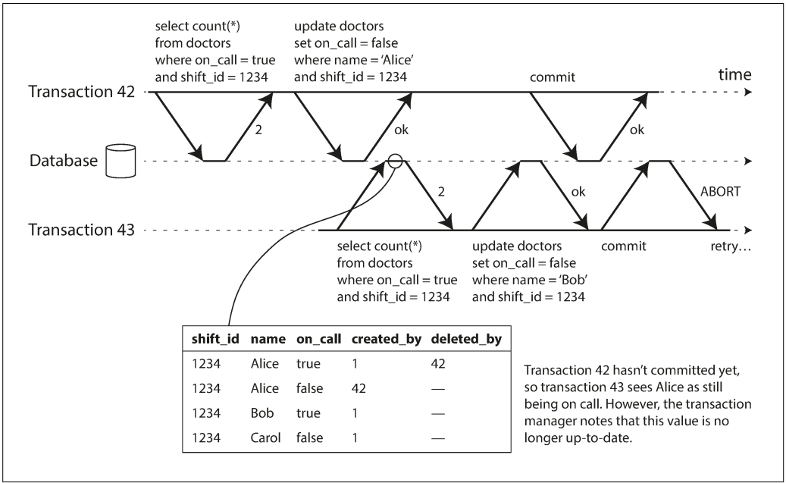

#### Detecting writes that affect prior reads

When a transaction writes to the database, it must look in the indexes for any other transactions that have recently read the affected data. This process is similar to acquiring a write lock on the affected key range, but rather than blocking until the readers have committed, the lock acts as a tripwire: it simply notifies the transactions that the data they read may no longer be up to date.

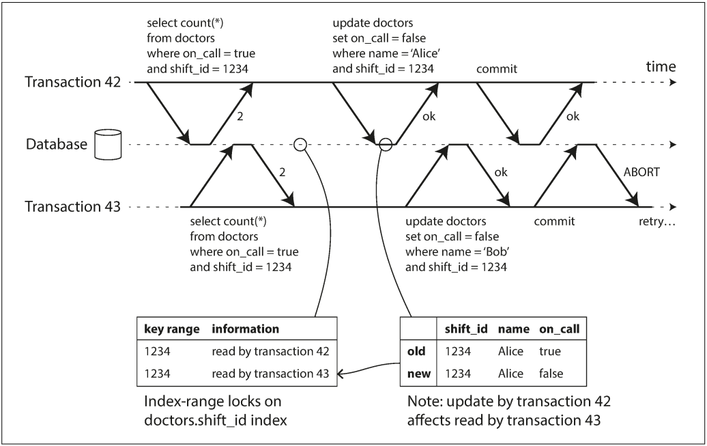