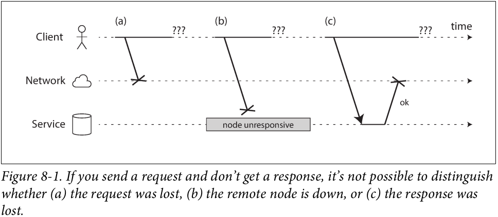
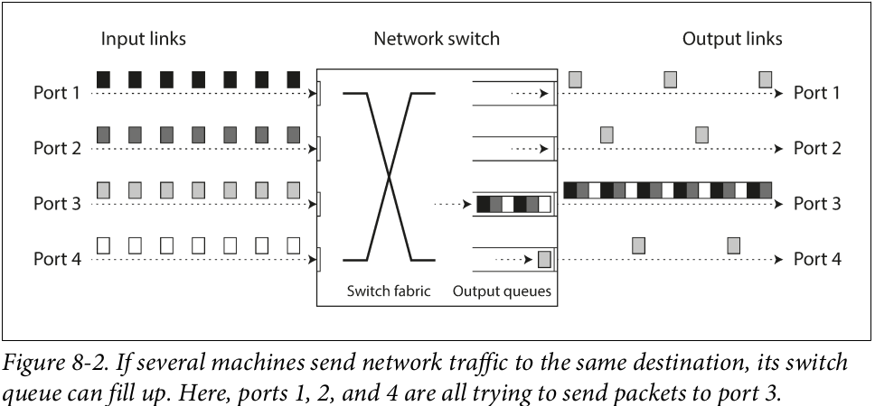
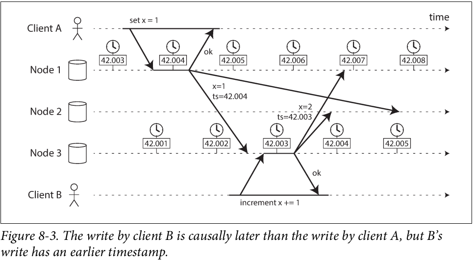
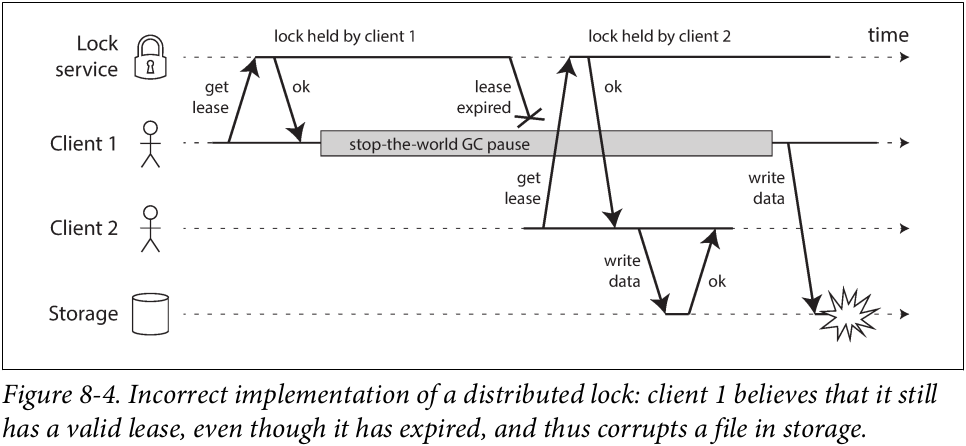
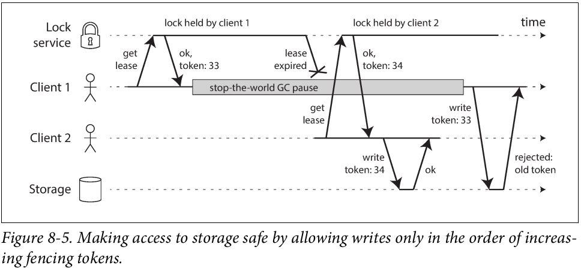

# Chapter 8 - The Trouble with Distributed Systems

A recurring theme in the last few chapters has been how systems handle things going wrong. As we come to understand various edge cases that can occur in real systems, we get better at handling them.

However, even though we have talked a lot about faults, the last few chapters have still been too optimistic. The reality is even darker. We will now turn our pessimism to the maximum and assume that anything that _can_ go wrong _will_ go wrong.

Working with distributed systems is fundamentally different from writing software on a single computer—and the main difference is that there are lots of new and exciting ways for things to go wrong.

In the end, our task as engineers is to build systems that do their job (i.e., meet the guarantees that users are expecting), in spite of everything going wrong.

This chapter is a thoroughly pessimistic and depressing overview of things that may go wrong in a distributed system.

## Faults and Partial Failures
When you are writing a program on a single computer, it normally behaves in a fairly predictable way: either it works or it doesn’t.

There is no fundamental reason why software on a single computer should be flaky: when the hardware is working correctly, the same operation always produces the same result (it is deterministic). If there is a hardware problem (e.g., memory corruption or a loose connector), the consequence is usually a total system failure (e.g., kernel panic, “blue screen of death,” failure to start up). An individual computer with good software is usually either fully functional or entirely broken, but not something in between.

This is a deliberate choice in the design of computers: if an internal fault occurs, we prefer a computer to crash completely rather than returning a wrong result, because wrong results are difficult and confusing to deal with. Thus, computers hide the fuzzy physical reality on which they are implemented and present an idealized system model that operates with mathematical perfection. A CPU instruction always does the same thing; if you write some data to memory or disk, that data remains intact and doesn’t get randomly corrupted. This design goal of always-correct computation goes all the way back to the very first digital computer

When you are writing software that runs on several computers, connected by a network, the situation is fundamentally different. In distributed systems, we are no longer operating in an idealized system model - we have no choice but to confront the messy reality of the physical world. And in the physical world, a remarkably wide range of things can go wrong.

In a distributed system, there may well be some parts of the system that are broken in some unpredictable way, even though other parts of the system are working fine. This is known as a partial failure. The difficulty is that partial failures are _nondeterministic_.

This nondeterminism and possibility of partial failures is what makes distributed systems hard to work with.

# Cloud Computing and Supercomputing

There is a spectrum of philosophies on how to build large-scale computing systems:

- At one end of the scale is the field of high-performance computing (HPC). Supercomputers with thousands of CPUs are typically used for computationally intensive scientific computing tasks, such as weather forecasting or molecular dynamics (simulating the movement of atoms and molecules).

- At the other extreme is cloud computing, which is not very well defined but is often associated with multi-tenant datacenters, commodity computers connected with an IP network (often Ethernet), elastic/on-demand resource allocation, and metered billing.

- Traditional enterprise datacenters lie somewhere between these extremes.

With these philosophies come very different approaches to handling faults. In a supercomputer, a job typically checkpoints the state of its computation to durable storage from time to time. If one node fails, a common solution is to simply stop the entire cluster workload. After the faulty node is repaired, the computation is restarted from the last checkpoint. Thus, a supercomputer is more like a single-node computer than a distributed system: it deals with partial failure by letting it escalate into total failure—if any part of the system fails, just let everything crash (like a kernel panic on a single machine).

In this book we focus on systems for implementing internet services, which usually look very different from supercomputers.

If we want to make distributed systems work, we must accept the possibility of partial failure and build fault-tolerance mechanisms into the software. In other words, we need to build a reliable system from unreliable components.

Even in smaller systems consisting of only a few nodes, it’s important to think about partial failure. In a small system, it’s quite likely that most of the components are working correctly most of the time. However, sooner or later, some part of the system will become faulty, and the software will have to somehow handle it. The fault handling must be part of the software design, and you (as operator of the software) need to know what behavior to expect from the software in the case of a fault.

In distributed systems, suspicion, pessimism, and paranoia pay off.

## Building a Reliable System from Unreliable Components

You may wonder whether this makes any sense—intuitively it may seem like a system
can only be as reliable as its least reliable component (its weakest link). This is not the case: in fact, it is an old idea in computing to construct a more reliable system from a less reliable underlying base.

For instance: IP (the Internet Protocol) is unreliable! It may drop, delay, duplicate, or reorder packets. TCP (the Transmission Control Protocol) provides a more reliable
transport layer on top of IP.

As discussed in the introduction to Part II, the distributed systems we focus on in this
book are _shared-nothing_ systems shared-nothing systems: i.e., a bunch of machines connected by a network. The network is the only way those machines can communicate - we assume that each machine has its own memory and disk, and one machine cannot access another machine’s memory or disk (except by making requests to a service over the network).

Shared-nothing is not the only way of building systems, but it has become the dominant approach for building internet services, for several reasons: it’s comparatively cheap because it requires no special hardware, it can make use of commoditized cloud computing services, and it can achieve high reliability through redundancy across multiple geographically distributed datacenters.

The internet and most internal networks in datacenters (often Ethernet) are _asynchronous packet networks_. In this kind of network, one node can send a message (a packet) to another node, but the network gives no guarantees as to when it will arrive, or whether it will arrive at all. If you send a request and expect a response, many things could go wrong.



## Network Faults in Practice

We have been building computer networks for decades—one might hope that by now we would have figured out how to make them reliable. However, it seems that we have not yet succeeded.

Even if network faults are rare in your environment, the fact that faults can occur means that your software needs to be able to handle them.  Whenever any communication happens over a network, it may fail - there is no way around it.

If the error handling of network faults is not defined and tested, arbitrarily bad things could happen: for example, the cluster could become deadlocked and permanently unable to serve requests, even when the network recovers, or it could even delete all of your data. If software is put in an unanticipated situation, it may do arbitrary unexpected things.

## Detecting Faults

Many systems need to automatically detect faulty nodes. For example:
- A load balancer needs to stop sending requests to a node that is dead (i.e., take it out of rotation).
- In a distributed database with single-leader replication, if the leader fails, one of the followers needs to be promoted to be the new leader.

Rapid feedback about a remote node being down is useful, but you can’t count on it. Even if TCP acknowledges that a packet was delivered, the application may have crashed before handling it.

Unfortunately, the uncertainty about the network makes it difficult to tell whether a node is working or not. In some specific circumstances you might get some feedback to explicitly tell you that something is not working.

Conversely, if something has gone wrong, you may get an error response at some level of the stack, but in general you have to assume that you will get no response at all. You can retry a few times (TCP retries transparently, but you may also retry at the application level), wait for a timeout to elapse, and eventually declare the node dead if you don’t hear back within the timeout.

## Timeouts and Unbounded Delays
If a timeout is the only sure way of detecting a fault, then how long should the timeout be? There is unfortunately no simple answer.

A long timeout means a long wait until a node is declared dead (and during this time, users may have to wait or see error messages). A short timeout detects faults faster, but carries a higher risk of incorrectly declaring a node dead when in fact it has only suffered a temporary slowdown (e.g., due to a load spike on the node or the network).

Prematurely declaring a node dead is problematic: if the node is actually alive and in the middle of performing some action (for example, sending an email), and another node takes over, the action may end up being performed twice.

When a node is declared dead, its responsibilities need to be transferred to other nodes, which places additional load on other nodes and the network. If the system is already struggling with high load, declaring nodes dead prematurely can make the problem worse.

Imagine a fictitious system with a network that guaranteed a maximum delay for packets - every packet is either delivered within some time _d_, or it is lost, but delivery never takes longer than _d_. Furthermore, assume that you can guarantee that a non-failed node always handles a request within some time _r_. In this case, you could guarantee that every successful request receives a response within time `2d + r` - and if you don’t receive a response within that time, you know that either the network or the remote node is not working. If this was true, `2d + r` would be a reasonable timeout to use.

### Networking congestion and queueing

When driving a car, travel times on road networks often vary most due to traffic congestion. Similarly, the variability of packet delays on computer networks is most often due to queueing.



Moreover, TCP considers a packet to be lost if it is not acknowledged within some timeout (which is calculated from observed round-trip times), and lost packets are automatically retransmitted.

#### TCP Versus UDP
Some latency-sensitive applications, such as videoconferencing and Voice over IP (VoIP), use UDP rather than TCP. It’s a trade-off between reliability and variability of delays: as UDP does not perform flow control and does not retransmit lost packets, it avoids some of the reasons for variable network delays (although it is still susceptible to switch queues and scheduling delays).

UDP is a good choice in situations where delayed data is worthless. For example, in a VoIP phone call, there probably isn’t enough time to retransmit a lost packet before its data is due to be played over the loudspeakers. In this case, there’s no point in retransmitting the packet—the application must instead fill the missing packet’s time slot with silence (causing a brief interruption in the sound) and move on in the stream. The retry happens at the human layer instead. (“Could you repeat that please? The sound just cut out for a moment.”)

In public clouds and multi-tenant datacenters, resources are shared among many customers: the network links and switches, and even each machine’s network inter‐ face and CPUs (when running on virtual machines), are shared.

In such environments, you can only choose timeouts experimentally: measure the distribution of network round-trip times over an extended period, and over many machines, to determine the expected variability of delays. Then, taking into account your application’s characteristics, you can determine an appropriate trade-off between failure detection delay and risk of premature timeouts.

Even better, rather than using configured constant timeouts, systems can continually measure response times and their variability (jitter), and automatically adjust timeouts according to the observed response time distribution. This can be done with a Phi Accrual failure detector.

## Synchronous Versus Asynchronous Networks

Distributed systems would be a lot simpler if we could rely on the network to deliver packets with some fixed maximum delay, and not to drop packets. Why can’t we solve this at the hardware level and make the network reliable so that the software
doesn’t need to worry about it?

To answer this question, it’s interesting to compare datacenter networks to the traditional fixed-line telephone network (non-cellular, non-VoIP), which is extremely reliable: delayed audio frames and dropped calls are very rare. A phone call requires a constantly low end-to-end latency and enough bandwidth to transfer the audio samples of your voice.

When you make a call over the telephone network, it establishes a circuit: a fixed, guaranteed amount of bandwidth is allocated for the call, along the entire route between the two callers. This circuit remains in place until the call ends

This kind of network is synchronous: even as data passes through several routers, it does not suffer from queueing, because the 16 bits of space for the call have already been reserved in the next hop of the network. And because there is no queueing, the maximum end-to-end latency of the network is fixed. We call this a bounded delay.

### Can we not simply make network delays predictable?

Note that a circuit in a telephone network is very different from a TCP connection: a circuit is a fixed amount of reserved bandwidth which nobody else can use while the circuit is established, whereas the packets of a TCP connection opportunistically use whatever network bandwidth is available. You can give TCP a variable-sized block of data (e.g., an email or a web page), and it will try to transfer it in the shortest time possible. While a TCP connection is idle, it doesn’t use any bandwidth. These protocols do not have the concept of a circuit.

Why do datacenter networks and the internet use packet switching? The answer is that they are optimized for bursty traffic. A circuit is good for an audio or video call, which needs to transfer a fairly constant number of bits per second for the duration of the call. On the other hand, requesting a web page, sending an email, or transferring a file doesn’t have any particular bandwidth requirement - we just want it to complete as quickly as possible.

If you wanted to transfer a file over a circuit, you would have to guess a bandwidth allocation. If you guess too low, the transfer is unnecessarily slow, leaving network capacity unused. If you guess too high, the circuit cannot be set up (because the net‐ work cannot allow a circuit to be created if its bandwidth allocation cannot be guar‐ anteed). TCP dynamically adapts the rate of data transfer to the available network capacity.

Variable delays in networks are not a law of nature, but simply the result of a cost/
benefit trade-off.

Currently deployed technology does not allow us to make any guarantees about delays or reliability of the network: we have to assume that network congestion, queueing, and unbounded delays will happen. Consequently, there’s no “correct” value for timeouts—they need to be determined experimentally.

## Unreliable Clocks

In a distributed system, time is a tricky business, because communication is not instantaneous: it takes time for a message to travel across the network from one machine to another.

Moreover, each machine on the network has its own clock, which is an actual hardware device: usually a quartz crystal oscillator.

It is possible to synchronize clocks to some degree: the most commonly used mechanism is the Network Time Protocol (NTP), which allows the computer clock to be adjusted according to the time reported by a group of servers.

## Monotonic Versus time-of-Day Clocks

Modern computers have at least two different kinds of clocks: a time-of-day clock and a monotonic clock. Although they both measure time, it is important to distinguish the two, since they serve different purposes.

### Time-of-day clocks

A time-of-day clock does what you intuitively expect of a clock: it returns the current date and time according to some calendar (also known as wall-clock time). They are usually synchronized with NTP, which means that a timestamp from one machine (ideally) means the same as a timestamp on another machine.

However, time-of-day clocks also have various oddities, as described in the next section. In particular, if the local clock is too far ahead of the NTP server, it may be forcibly reset and appear to jump back to a previous point in time. These jumps, as well as the fact that they often ignore leap seconds, make time-of-day clocks unsuitable for measuring elapsed time.

### Monotonic Clocks

A monotonic clock is suitable for measuring a duration (time interval). You can check the value of the monotonic clock at one point in time, do something,
and then check the clock again at a later time. The difference between the two values tells you how much time elapsed between the two checks. However, the 
absolute value of the clock is meaningless: it might be the number of nanoseconds since the computer was started, or something similarly arbitrary.

On a server with multiple CPU sockets, there may be a separate timer per CPU, which is not necessarily synchronized with other CPUs.

NTP may adjust the frequency at which the monotonic clock moves forward (this is known as slewing the clock) if it detects that the computer’s local quartz is moving
faster or slower than the NTP server.

## Clock Synchronization and Accuracy

Monotonic clocks don’t need synchronization, but time-of-day clocks need to be set according to an NTP server or other external time source in order to be useful.

It is possible to achieve very good clock accuracy if you care about it sufficiently to invest significant resources. For example, the MiFID II draft European regulation for financial institutions requires all high-frequency trading funds to synchronize their clocks to within 100 microseconds of UTC, in order to help debug market anomalies such as “flash crashes” and to help detect market manipulation.

Such accuracy can be achieved using GPS receivers, the Precision Time Protocol (PTP), and careful deployment and monitoring.

## Relying on Synchronized Clocks

The problem with clocks is that while they seem simple and easy to use, they have a surprising number of pitfalls: a day may not have exactly 86,400 seconds, time-of-day clocks may move backward in time, and the time on one node may be quite different from the time on another node.

Even though networks are well behaved most of the time, software must be designed on the assumption that the network will occasionally be faulty, and the software must handle such faults gracefully.

Part of the problem is that incorrect clocks easily go unnoticed. If some piece of software is relying on an accurately synchronized clock, the result is more likely to be silent and subtle data loss than a dramatic crash.

Thus, if you use software that requires synchronized clocks, it is essential that you also carefully monitor the clock offsets between all the machines. Any node whose clock drifts too far from the others should be declared dead and removed from the cluster. Such monitoring ensures that you notice the broken clocks before they can cause too much damage.

### Timestamps for ordering events
Let’s consider one particular situation in which it is tempting, but dangerous, to rely on clocks: ordering of events across multiple nodes. For example, if two clients write to a distributed database, who got there first? Which write is the more recent one?



Even though it is tempting to resolve conflicts by keeping the most “recent” value and discarding others, it’s important to be aware that the definition of “recent” depends on a local time-of-day clock, which may well be incorrect.

Could NTP synchronization be made accurate enough that such incorrect orderings cannot occur? Probably not, because NTP’s synchronization accuracy is itself limited by the network round-trip time, in addition to other sources of error such as quartz drift. For correct ordering, you would need the clock source to be significantly more accurate than the thing you are measuring (namely network delay).

So-called logical clocks which are based on incrementing counters rather than an oscillating quartz crystal, are a safer alternative for ordering events.

### Clock readings have a confidence interval

You may be able to read a machine’s time-of-day clock with microsecond or even nanosecond resolution. But even if you can get such a fine-grained measurement, that doesn’t mean the value is actually accurate to such precision. In fact, it most likely is not—as mentioned previously, the drift in an imprecise quartz clock can easily be several milliseconds, even if you synchronize with an NTP server on the local network every minute.

Thus, it doesn’t make sense to think of a clock reading as a point in time - it is more like a range of times, within a confidence interval: for example, a system may be 95% confident that the time now is between 10.3 and 10.5 seconds past the minute, but it doesn’t know any more precisely than that.

Unfortunately, most systems don’t expose this uncertainty: for example, when you call `clock_gettime()`, the return value doesn’t tell you the expected error of the
timestamp, so you don’t know if its confidence interval is five milliseconds or five years.

An interesting exception is Google’s _TrueTime_ API in Spanner, which explicitly reports the confidence interval on the local clock. When you ask it for the current time, you get back two values: [earliest, latest], which are the earliest possible and the latest possible _timestamp_.

### Synchronized clocks for global snapshots

The most common implementation of snapshot isolation requires a monotonically increasing transaction ID. If a write happened later than the snapshot (i.e., the write has a greater transaction ID than the snapshot), that write is invisible to the snapshot transaction. On a single-node database, a simple counter is sufficient for generating transaction IDs.

However, when a database is distributed across many machines, potentially in multiple datacenters, a global, monotonically increasing transaction ID (across all partitions) is difficult to generate, because it requires coordination. The transaction ID must reflect causality: if transaction B reads a value that was written by transaction A, then B must have a higher transaction ID than A - otherwise, the snapshot would not be consistent. With lots of small, rapid transactions, creating transaction IDs in a distributed system becomes an untenable bottleneck.

Can we use the timestamps from synchronized time-of-day clocks as transaction IDs? If we could get the synchronization good enough, they would have the right proper‐ ties: later transactions have a higher timestamp. The problem, of course, is the uncertainty about clock accuracy.

Spanner implements snapshot isolation across datacenters in this way: if you have two confidence intervals, each consisting of an earliest and latest possible timestamp (A = [A_earliest, A_latest] and B = [B_earliest, B_latest]), and those two intervals do not overlap (i.e., A_earliest < A_latest < B_earliest < B_latest), then B definitely happened after A - there can be no doubt. Only if the intervals overlap are we unsure in which order A and B happened.

In order to ensure that transaction timestamps reflect causality, Spanner deliberately waits for the length of the confidence interval before committing a read-write transaction.

## Process Pauses

Let’s consider another example of dangerous clock use in a distributed system. Say you have a database with a single leader per partition. Only the leader is allowed to accept writes. How does a node know that it is still leader (that it hasn’t been declared dead by the others), and that it may safely accept writes?

One option is for the leader to obtain a _lease_ from the other nodes, which is similar to a lock with a timeout. Only one node can hold the lease at any one time—thus, when a node obtains a lease, it knows that it is the leader for some amount of time, until the lease expires. In order to remain leader, the node must periodically renew the lease before it expires. If the node fails, it stops renewing the lease, so another node can take over when it expires.

```javascript
while (true) {
    request = getIncomingRequest();

    // Ensure that the lease always has at least 10 seconds remaining
    if (lease.expiryTimeMillis - System.currentTimeMillis() < 10000) {
        lease = lease.renew();
    }

    if (lease.isValid()) {
        process(request);
    }
}
```

What’s wrong with this code? Firstly, it’s relying on synchronized clocks: the expiry time on the lease is set by a different machine (where the expiry may be calculated as the current time plus 30 seconds, for example), and it’s being compared to the local system clock. If the clocks are out of sync by more than a few seconds, this code will start doing strange things.

Secondly, even if we change the protocol to only use the local monotonic clock, there is another problem: the code assumes that very little time passes between the point that it checks the time ( `System.currentTimeMillis()` ) and the time when the request is processed ( `process(request)` ). Normally this code runs very quickly, so the 10 second buffer is more than enough to ensure that the lease doesn’t expire in the middle of processing a request.

However, what if there is an unexpected pause in the execution of the program? For example, imagine the thread stops for 15 seconds around the line lease.isValid() before finally continuing. In that case, it’s likely that the lease will have expired by the time the request is processed, and another node has already taken over as leader. However, there is nothing to tell this thread that it was paused for so long, so this code won’t notice that the lease has expired until the next iteration of the loop—by which time it may have already done something unsafe by processing the request.

When writing multi-threaded code on a single machine, we have fairly good tools for making it thread-safe: mutexes, semaphores, atomic counters, lock-free data structures, blocking queues, and so on. Unfortunately, these tools don’t directly translate to distributed systems, because a distributed system has no shared memory—only messages sent over an unreliable network.

A node in a distributed system must assume that its execution can be paused for a significant length of time at any point, even in the middle of a function. During the pause, the rest of the world keeps moving and may even declare the paused node dead because it’s not responding. Eventually, the paused node may continue running, without even noticing that it was asleep until it checks its clock sometime later. 

### Response time guarantees

Some software runs in environments where a failure to respond within a specified time can cause serious damage: computers that control aircraft, rockets, robots, cars, and other physical objects must respond quickly and predictably to their sensor inputs. In these systems, there is a specified _deadline_ by which the software must respond; if it doesn’t meet the deadline, that may cause a failure of the entire system. These are so-called _hard real-time_ systems.

For example, if your car’s onboard sensors detect that you are currently experiencing a crash, you wouldn’t want the release of the airbag to be delayed due to an inopportune GC pause in the airbag release system.

Developing real-time systems is very expensive, and they are most commonly used in safety-critical embedded devices. Moreover, “real-time” is not the same as “high- performance” - in fact, real-time systems may have lower throughput, since they have to prioritize timely responses above all else.

For most server-side data processing systems, real-time guarantees are simply not economical or appropriate. Consequently, these systems must suffer the pauses and clock instability that come from operating in a non-real-time environment.

### Limiting the impact of garbage collection

An emerging idea is to treat GC pauses like brief planned outages of a node, and to let other nodes handle requests from clients while one node is collecting its garbage. If the runtime can warn the application that a node soon requires a GC pause, the application can stop sending new requests to that node, wait for it to finish process‐ ing outstanding requests, and then perform the GC while no requests are in progress. This trick hides GC pauses from clients and reduces the high percentiles of response time [70, 71]. Some latency-sensitive financial trading systems [72] use this approach.

A variant of this idea is to use the garbage collector only for short-lived objects (which are fast to collect) and to restart processes periodically, before they accumulate enough long-lived objects to require a full GC of long-lived objects [65, 73]. One node can be restarted at a time, and traffic can be shifted away from the node before the planned restart, like in a rolling upgrade.

## Knowledge, Truth and Lies
So far in this chapter we have explored the ways in which distributed systems are different from programs running on a single computer: there is no shared memory, only message passing via an unreliable network with variable delays, and the systems may suffer from partial failures, unreliable clocks, and processing pauses.

## The Truth is Defined by the Majority

Imagine a network with an asymmetric fault: a node is able to receive all messages sent to it, but any outgoing messages from that node are dropped or delayed.

Even though that node is working perfectly well, and is receiving requests from other nodes, the other nodes cannot hear its responses. After some timeout, the other nodes declare it dead, because they haven’t heard from the node.

In a slightly less nightmarish scenario, the semi-disconnected node may notice that the messages it is sending are not being acknowledged by other nodes, and so realize that there must be a fault in the network. Nevertheless, the node is wrongly declared dead by the other nodes, and the semi-disconnected node cannot do anything about it.

As a third scenario, imagine a node that experiences a long stop-the-world garbage collection pause. All of the node’s threads are preempted by the GC and paused for one minute, and consequently, no requests are processed and no responses are sent. The other nodes wait, retry, grow impatient, and eventually declare the node dead and load it onto the hearse. Finally, the GC finishes and the node’s threads continue as if nothing had happened. The other nodes are surprised as the supposedly dead node suddenly raises its head out of the coffin, in full health, and starts cheerfully chatting with bystanders. At first, the GCing node doesn’t even realize that an entire minute has passed and that it was declared dead—from its perspective, hardly any time has passed since it was last talking to the other nodes.

The moral of these stories is that a node cannot necessarily trust its own judgment of a situation. A distributed system cannot exclusively rely on a single node, because a node may fail at any time, potentially leaving the system stuck and unable to recover. Instead, many distributed algorithms rely on a _quorum_, that is, voting among the nodes: decisions require some minimum number of votes from several nodes in order to reduce the dependence on any one particular node.

### The leader and the lock

A node may have formerly been the leader, but if the other nodes declared it dead in the meantime (e.g., due to a network interruption or GC pause), it may have been demoted and another leader may have already been elected.

Say you want to ensure that a file in a storage service can only be accessed by one client at a time, because if multiple clients tried to write to it, the file would become corrupted. You try to implement this by requiring a client to obtain a lease from a lock service before accessing the file.



The problem is an example of what we discussed in “Process Pauses” the client holding the lease is paused for too long, its lease expires.

### Fencing tokens



Let’s assume that every time the lock server grants a lock or lease, it also returns a _fencing token_, which is a number that increases every time a lock is granted (e.g., incremented by the lock service). We can then require that every time a client sends a write request to the storage service, it must include its current fencing token.

If ZooKeeper is used as lock service, the transaction ID `zxid` or the node version `cversion` can be used as fencing token. Since they are guaranteed to be monotonically increasing, they have the required properties.

Checking a token on the server side may seem like a downside, but it is arguably a good thing: it is unwise for a service to assume that its clients will always be well behaved, because the clients are often run by people whose priorities are very different from the priorities of the people running the service [76]. Thus, it is a good idea for any service to protect itself from accidentally abusive clients.

## Byzantine Faults
Fencing tokens can detect and block a node that is _inadvertently_ acting in error (e.g., because it hasn’t yet found out that its lease has expired). However, if the node deliberately wanted to subvert the system’s guarantees, it could easily do so by sending messages with a fake fencing token.

In this book we assume that nodes are unreliable but honest, they may fail, but it's not they're fault. A system is called _Byzantine fault-tolerant_ if it continues to operate correctly even if some of the nodes are malfunctioning and not obeying the protocol, or if malicious attackers are interfering with the network.

However, in the kinds of systems we discuss in this book, we can usually safely assume that there are no Byzantine faults. In your datacenter, all the nodes are con‐ trolled by your organization (so they can hopefully be trusted) and radiation levels are low enough that memory corruption is not a major problem.

Web applications do need to expect arbitrary and malicious behavior of clients that are under end-user control, such as web browsers. This is why input validation, sanitization, and output escaping are so important: to prevent SQL injection and cross- site scripting, for example. However, we typically don’t use Byzantine fault-tolerant protocols here, but simply make the server the authority on deciding what client behavior is and isn’t allowed. In peer-to-peer networks, where there is no such central authority, Byzantine fault tolerance is more relevant.

A bug in the software could be regarded as a Byzantine fault, but if you deploy the same software to all nodes, then a Byzantine fault-tolerant algorithm cannot save you.

Similarly, it would be appealing if a protocol could protect us from vulnerabilities, security compromises, and malicious attacks. Unfortunately, this is not realistic either: in most systems, if an attacker can compromise one node, they can probably compromise all of them, because they are probably running the same software.

### Weak forms of lying

Although we assume that nodes are generally honest, it can be worth adding mechanisms to software that guard against weak forms of “lying”—for example, invalid messages due to hardware issues, software bugs, and misconfiguration.

## System Model and Reality

Algorithms need to be written in a way that does not depend too heavily on the details of the hardware and software configuration on which they are run. This in turn requires that we somehow formalize the kinds of faults that we expect to happen in a system. We do this by defining a system model, which is an abstraction that describes what things an algorithm may assume.

With regard to timing assumptions, three system models are in common use:

_Synchronous model_
- The synchronous model assumes bounded network delay, bounded process pauses, and bounded clock error. This does not imply exactly synchronized clocks or zero network delay; it just means you know that network delay, pauses, and clock drift will never exceed some fixed upper bound. The synchronous model is not a realistic model of most practical systems, because (as discussed in this chapter) unbounded delays and pauses do occur.

_Partially synchronous model_
- Partial synchrony means that a system behaves like a synchronous system most of the time, but it sometimes exceeds the bounds for network delay, process pauses, and clock drift. This is a realistic model of many systems: most of the time, networks and processes are quite well behaved—otherwise we would never be able to get anything done—but we have to reckon with the fact that any timing assumptions may be shattered occasionally. When this happens, network delay, pauses, and clock error may become arbitrarily large.

_Asynchronous model_
- In this model, an algorithm is not allowed to make any timing assumptions - in fact, it does not even have a clock (so it cannot use timeouts). Some algorithms can be designed for the asynchronous model, but it is very restrictive.

Moreover, besides timing issues, we have to consider node failures. The three most common system models for nodes are:

_Crash-stop faults_
- In the crash-stop model, an algorithm may assume that a node can fail in only one way, namely by crashing. This means that the node may suddenly stop responding at any moment, and thereafter that node is gone forever—it never comes back.

_Crash-recovery faults_
- We assume that nodes may crash at any moment, and perhaps start responding again after some unknown time. In the crash-recovery model, nodes are assumed to have stable storage (i.e., nonvolatile disk storage) that is preserved across crashes, while the in-memory state is assumed to be lost.

_Byzantine (arbitrary) faults_
- Nodes may do absolutely anything, including trying to trick and deceive other nodes, as described in the last section.

For modeling real systems, the partially synchronous model with crash-recovery faults is generally the most useful model. But how do distributed algorithms cope with that model?

### Correctness of an algorithm

To define what it means for an algorithm to be _correct_, we can describe its _properties_.

### Safety and liveness
To clarify the situation, it is worth distinguishing between two different kinds of
properties: _safety_ and _liveness_ properties.

Safety is often informally defined as nothing bad happens, and liveness as something good eventually happens. However, it’s best to not read too much into those informal definitions, because the meaning of good and bad is subjective.

An advantage of distinguishing between safety and liveness properties is that it helps us deal with difficult system models. For distributed algorithms, it is common to require that safety properties _always_ hold, in all possible situations of a system model. That is, even if all nodes crash, or the entire network fails, the algorithm must nevertheless ensure that it does not return a wrong result (i.e., that the safety proper‐ ties remain satisfied).

### Mapping system models to the real world

Safety and liveness properties and system models are very useful for reasoning about the correctness of a distributed algorithm. However, when implementing an algo‐ rithm in practice, the messy facts of reality come back to bite you again, and it becomes clear that the system model is a simplified abstraction of reality.

The theoretical description of an algorithm can declare that certain things are simply assumed not to happen—and in non-Byzantine systems, we do have to make some assumptions about faults that can and cannot happen. However, a real implementation may still have to include code to handle the case where something happens that was assumed to be impossible, even if that handling boils down to `printf("Sucks to be you")` and `exit(666)` - i.e., letting a human operator clean up the mess. (This is arguably the difference between computer science and software engineering.)

Proving an algorithm correct does not mean its _implementation_ on a real system will
necessarily always behave correctly.

## Summary
In this chapter we have discussed a wide range of problems that can occur in distributed systems.

- Whenever you try to send a packet over the network, it may be lost or arbitrarily delayed. Likewise, the reply may be lost or delayed, so if you don’t get a reply, you have no idea whether the message got through.

- A node’s clock may be significantly out of sync with other nodes (despite your best efforts to set up NTP), it may suddenly jump forward or back in time, and relying on it is dangerous because you most likely don’t have a good measure of your clock’s error interval.

- A process may pause for a substantial amount of time at any point in its execution (perhaps due to a stop-the-world garbage collector), be declared dead by other nodes, and then come back to life again without realizing that it was paused.

The fact that such _partial failures_ can occur is the defining characteristic of distributed systems. Whenever software tries to do anything involving other nodes, there is the possibility that it may occasionally fail, or randomly go slow, or not respond at all (and eventually time out). In distributed systems, we try to build tolerance of partial failures into software, so that the system as a whole may continue functioning even when some of its constituent parts are broken.

To tolerate faults, the first step is to detect them, but even that is hard. Timeouts can’t distinguish between network and node failures.

Once a fault is detected, making a system tolerate it is not easy either: there is no global variable, no shared memory, no common knowledge or any other kind of shared state between the machines.

Major decisions cannot be safely made by a single node, so we require protocols that enlist help from other nodes and try to get a quorum to agree.

If you’re used to writing software in the idealized mathematical perfection of a single computer, where the same operation always deterministically returns the same result, then moving to the messy physical reality of distributed systems can be a bit of a shock.

If you can avoid opening Pandora’s box and simply keep things on a single machine, it is generally worth doing so. Most non-safety-critical systems choose cheap and unreliable over expensive and reliable.