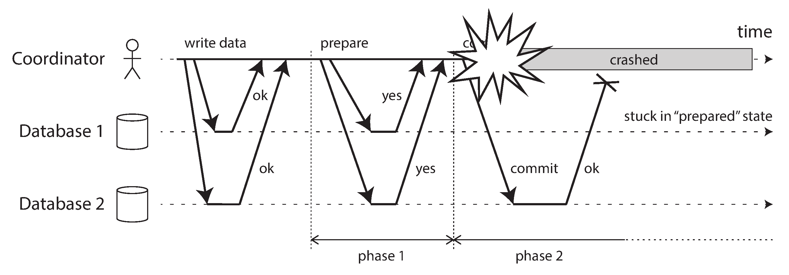

# Chapter 9 - Consistency and Consensus

In this chapter, we will talk about some examples of algorithms and protocols for building fault-tolerant distributed systems.

## Consistency Guarantees

Most replicated databases provide at least eventual consistency, which means that if you stop writing to the database and wait for some unspecified length of time, then eventually all read requests will return the same value [1]. In other words, the inconsistency is temporary, and it eventually resolves itself (assuming that any faults in the
network are also eventually repaired).

In this chapter we will explore stronger consistency models that data systems may choose to provide. They don’t come for free: systems with stronger guarantees may
have worse performance or be less fault-tolerant than systems with weaker guarantees

This chapter covers a broad range of topics, but as we shall see, these areas are in fact deeply linked:

* We will start by looking at one of the strongest consistency models in common use, linearizability, and examine its pros and cons.

* We’ll then examine the issue of ordering events in a distributed system, particularly around causality and total ordering.

* In the third section we will explore how to atomically commit a distributed transaction, which will finally lead us toward solutions for the consensus problem.

## Linearizability

In an eventually consistent database, if you ask two different replicas the same question at the same time, you may get two different answers. That’s confusing. Wouldn’t
it be a lot simpler if the database could give the illusion that there is only one replica (i.e., only one copy of the data)? Then every client would have the same view of the
data, and you wouldn’t have to worry about replication lag.

This is the idea behind linearizability.

To clarify this idea, let’s look at an example of a system that is not linearizable.

## What Makes a System Linearizable?

The basic idea behind linearizability is simple: to make a system appear as if there is only a single copy of the data.

Let’s look at some more examples.

Figure 9-2 shows three clients concurrently reading and writing the same key x in a linearizable database.

To make the system linearizable, we need to add another constraint, illustrated in Figure 9-3.

We can further refine this timing diagram to visualize each operation taking effect atomically at some point in time. A more complex example is shown in Figure 9-4.

In Figure 9-4 we add a third type of operation besides read and write:

## Relying on Linearizability

In what circumstances is linearizability useful?

### Locking and leader election

A system that uses single-leader replication needs to ensure that there is indeed only one leader, not several (split brain).

### Constraints and uniqueness guarantees

Uniqueness constraints are common in databases: for example, a username or email address must uniquely identify one user, and in a file storage service there cannot be two files with the same path and filename. If you want to enforce this constraint as the data is written (such that if two people try to concurrently create a user or a file with the same name, one of them will be returned an error), you need linearizability.

### Cross-channel timing dependencies

Notice a detail in Figure 9-1: if Alice hadn’t exclaimed the score, Bob wouldn’t have known that the result of his query was stale. He would have just refreshed the page again a few seconds later, and eventually seen the final score. The linearizability violation was only noticed because there was an additional communication channel in the system (Alice’s voice to Bob’s ears).

Similar situations can arise in computer systems. For example, say you have a website where users can upload a photo, and a background process resizes the photos to lower resolution for faster download (thumbnails). The architecture and dataflow of this system is illustrated in Figure 9-5.

If the file storage service is linearizable, then this system should work fine. If it is not linearizable, there is the risk of a race condition: the message queue (steps 3 and 4 in Figure 9-5) might be faster than the internal replication inside the storage service. In
this case, when the resizer fetches the image (step 5), it might see an old version of the image, or nothing at all. If it processes an old version of the image, the full-size and resized images in the file storage become permanently inconsistent.

## Implementing Linearizable Systems

Now that we’ve looked at a few examples in which linearizability is useful, let’s think about how we might implement a system that offers linearizable semantics.

* Single-leader replication (potentially linearizable)
* Consensus algorithms (linearizable)
* Multi-leader replication (not linearizable)
* Leaderless replication (probably not linearizable)

## The Cost of Linearizability

As some replication methods can provide linearizability and others cannot, it is interesting to explore the pros and cons of linearizability in more depth.

We already discussed some use cases for different replication methods in Chapter 5; for example, we saw that multi-leader replication is often a good choice for multi-datacenter replication (see “Multi-datacenter operation” on page 168). An example of such a deployment is illustrated in Figure 9-7.

Consider what happens if there is a network interruption between the two datacenters. Let’s assume that the network within each datacenter is working, and clients can reach the datacenters, but the datacenters cannot connect to each other.

With a multi-leader database, each datacenter can continue operating normally: since writes from one datacenter are asynchronously replicated to the other, the writes are simply queued up and exchanged when network connectivity is restored.

On the other hand, if single-leader replication is used, then the leader must be in one of the datacenters. Any writes and any linearizable reads must be sent to the leader thus, for any clients connected to a follower datacenter, those read and write requests
must be sent synchronously over the network to the leader datacenter.

If the network between datacenters is interrupted in a single-leader setup, clients connected to follower datacenters cannot contact the leader, so they cannot make any writes to the database, nor any linearizable reads. They can still make reads from the follower, but they might be stale (nonlinearizable). If the application requires linearizable reads and writes, the network interruption causes the application to become unavailable in the datacenters that cannot contact the leader.

# Ordering Guarantees

Ordering has been a recurring theme in this book, which suggests that it might be an important fundamental idea. Let’s briefly recap some of the other contexts in which we have discussed ordering:

* In Chapter 5 we saw that the main purpose of the leader in single-leader replication is to determine the order of writes in the replication log;

* Serializability, which we discussed in Chapter 7, is about ensuring that transactions behave as if they were executed in some sequential order.

* The use of timestamps and clocks in distributed systems that we discussed in Chapter 8.

## Ordering and Causality

There are several reasons why ordering keeps coming up, and one of the reasons is that it helps preserve causality. We have already seen several examples over the course of this book where causality has been important.

Causality imposes an ordering on events: cause comes before effect; a message is sent before that message is received; the question comes before the answer.

## Sequence Number Ordering

Although causality is an important theoretical concept, actually keeping track of all causal dependencies can become impractical. In many applications, clients read lots of data before writing something, and then it is not clear whether the write is causally dependent on all or only some of those prior reads. Explicitly tracking all the data that has been read would mean a large overhead.

However, there is a better way: we can use sequence numbers or timestamps to order events. A timestamp need not come from a time-of-day clock (or physical clock, which have many problems, as discussed in “Unreliable Clocks” on page 287). It can instead come from a logical clock, which is an algorithm to generate a sequence of numbers to identify operations, typically using counters that are incremented for
every operation.

## Total Order Broadcast

If your program runs only on a single CPU core, it is easy to define a total ordering of operations: it is simply the order in which they were executed by the CPU. However, in a distributed system, getting all nodes to agree on the same total ordering of operations is tricky. In the last section we discussed ordering by timestamps or sequence numbers, but found that it is not as powerful as single-leader replication (if you use timestamp ordering to implement a uniqueness constraint, you cannot tolerate any faults).

As discussed, single-leader replication determines a total order of operations by choosing one node as the leader and sequencing all operations on a single CPU core on the leader. The challenge then is how to scale the system if the throughput is greater than a single leader can handle, and also how to handle failover if the leader fails. In the distributed systems literature, this problem is known as total order broadcast or atomic broadcast.

Total order broadcast is usually described as a protocol for exchanging messages between nodes. Informally, it requires that two safety properties always be satisfied:

* Reliable delivery: No messages are lost: if a message is delivered to one node, it is delivered to all nodes.

* Totally ordered delivery: Messages are delivered to every node in the same order.

A correct algorithm for total order broadcast must ensure that the reliability and ordering properties are always satisfied, even if a node or the network is faulty. Of course, messages will not be delivered while the network is interrupted, but an algorithm can keep retrying so that the messages get through when the network is eventually repaired.

# Distributed Transactions and Consensus

Consensus is one of the most important and fundamental problems in distributed computing. On the surface, it seems simple: informally, the goal is simply to get several nodes to agree on something.

Now that we have discussed replication (Chapter 5), transactions (Chapter 7), system models (Chapter 8), linearizability, and total order
broadcast (this chapter), we are finally ready to tackle the consensus problem.

There are a number of situations in which it is important for nodes to agree. For example:

* Leader election: In a database with single-leader replication, all nodes need to agree on which node is the leader.

* Atomic commit: In a database that supports transactions spanning several nodes or partitions, we have the problem that a transaction may fail on some nodes but succeed on others. If we want to maintain transaction atomicity, we have to get all nodes to agree on the outcome of the transaction: either they all abort/roll back or they all commit.

## Atomic Commit and Two-Phase Commit (2PC)

In Chapter 7 we learned that the purpose of transaction atomicity is to provide simple semantics in the case where something goes wrong in the middle of making several writes. The outcome of a transaction is either a successful commit, in which case all of the transaction’s writes are made durable, or an abort, in which case all of the transaction’s writes are rolled back (i.e., undone or discarded).

### From single-node to distributed atomic commit

Thus, on a single node, transaction commitment crucially depends on the order in which data is durably written to disk: first the data, then the commit record [72]. The key deciding moment for whether the transaction commits or aborts is the moment at which the disk finishes writing the commit record: before that moment, it is still possible to abort (due to a crash), but after that moment, the transaction is committed (even if the database crashes). Thus, it is a single device (the controller of one particular disk drive, attached to one particular node) that makes the commit atomic.

However, what if multiple nodes are involved in a transaction? For example, perhaps you have a multi-object transaction in a partitioned database.

In these cases, it is not sufficient to simply send a commit request to all of the nodes and independently commit the transaction on each one. In doing so, it could easily happen that the commit succeeds on some nodes and fails on other nodes, which would violate the atomicity guarantee.

If some nodes commit the transaction but others abort it, the nodes become inconsistent with each other. And once a transaction has been committed on one node, it cannot be retracted again if it later turns out that it was aborted on another node. For this reason, a node must only commit once it is certain that all other nodes in the transaction are also going to commit.

### Introduction to two-phase commit

Two-phase commit is an algorithm for achieving atomic transaction commit across multiple nodes.

The basic flow of 2PC is illustrated in Figure 9-9. Instead of a single commit request, as with a single-node transaction, the commit/abort process in 2PC is split into two phases (hence the name).

2PC uses a new component that does not normally appear in single-node transactions: a coordinator (also known as transaction manager).

A 2PC transaction begins with the application reading and writing data on multiple database nodes, as normal. We call these database nodes participants in the transaction. When the application is ready to commit, the coordinator begins phase 1: it sends a prepare request to each of the nodes, asking them whether they are able to commit. The coordinator then tracks the responses from the participants:

* If all participants reply “yes,” indicating they are ready to commit, then the coordinator sends out a commit request in phase 2, and the commit actually takes place.

* If any of the participants replies “no,” the coordinator sends an abort request to all nodes in phase 2.

### Coordinator failure

We have discussed what happens if one of the participants or the network fails during 2PC: if any of the prepare requests fail or time out, the coordinator aborts the transaction; if any of the commit or abort requests fail, the coordinator retries them indefinitely. However, it is less clear what happens if the coordinator crashes.

If the coordinator fails before sending the prepare requests, a participant can safely abort the transaction. But once the participant has received a prepare request and voted “yes,” it can no longer abort unilaterally—it must wait to hear back from the coordinator whether the transaction was committed or aborted. If the coordinator crashes or the network fails at this point, the participant can do nothing but wait. A participant’s transaction in this state is called in doubt or uncertain. The situation is illustrated in Figure 9-10.

The only way 2PC can complete is by waiting for the coordinator to recover. This is why the coordinator must write its commit or abort decision to a transaction log on disk before sending commit or abort requests to participants: when the coordinator recovers, it determines the status of all in-doubt transactions by reading its transaction log.

### Three-phase commit

Two-phase commit is called a blocking atomic commit protocol due to the fact that 2PC can become stuck waiting for the coordinator to recover.

As an alternative to 2PC, an algorithm called three-phase commit (3PC) has been proposed. However, 3PC assumes a network with bounded delay and nodes with bounded response times; in most practical systems with unbounded network delay and process pauses (see Chapter 8), it cannot guarantee atomicity.

In general, nonblocking atomic commit requires a perfect failure detector, a reliable mechanism for telling whether a node has crashed or not. In a network with unbounded delay a timeout is not a reliable failure detector, because a request may time out due to a network problem even if no node has crashed. For this reason, 2PC continues to be used, despite the known problem with coordinator failure.

## Distributed Transactions in Practice

Distributed transactions, especially those implemented with two-phase commit, have a mixed reputation. On the one hand, they are seen as providing an important safety guarantee that would be hard to achieve otherwise; on the other hand, they are criticized for causing operational problems, killing performance, and promising more than they can deliver.

Some implementations of distributed transactions carry a heavy performance penalty for example, distributed transactions in MySQL are reported to be over 10 times slower than single-node transactions, so it is not surprising when people advise against using them. Much of the performance cost inherent in two-phase commit is due to the additional disk forcing ( fsync ) that is required for crash recovery, and
the additional network round-trips.

## Fault-Tolerant Consensus

The consensus problem is normally formalized as follows: one or more nodes may propose values, and the consensus algorithm decides on one of those values. In the seat-booking example, when several customers are concurrently trying to buy the last seat, each node handling a customer request may propose the ID of the customer it is serving, and the decision indicates which one of those customers got the seat.

In this formalism, a consensus algorithm must satisfy the following properties:

* Uniform agreement: No two nodes decide differently.

* Integrity: No node decides twice.

* Validity: If a node decides value v, then v was proposed by some node.

* Termination: Every node that does not crash eventually decides some value.

If you don’t care about fault tolerance, then satisfying the first three properties is easy: you can just hardcode one node to be the “dictator,” and let that node make all of the decisions. However, if that one node fails, then the system can no longer make
any decisions. This is, in fact, what we saw in the case of two-phase commit: if the coordinator fails, in-doubt participants cannot decide whether to commit or abort.

### Consensus algorithms and total order broadcast
The best-known fault-tolerant consensus algorithms are Viewstamped Replication (VSR), Paxos, Raft, and Zab

### Single-leader replication and consensus
In Chapter 5 we discussed single-leader replication. How come we didn’t have to worry about consensus in Chapter 5?

The answer comes down to how the leader is chosen. If the leader is manually chosen and configured by the humans in your operations team, you essentially have a “consensus algorithm” but it does not satisfy the termination property of consensus because it requires human intervention in order to make progress.

Some databases perform automatic leader election and failover, promoting a follower to be the new leader if the old leader fails . This brings us closer to fault-tolerant total order broadcast, and thus to solving consensus.

However, there is a problem. We previously discussed the problem of split brain, and said that all nodes need to agree who the leader is—otherwise two different nodes could each believe themselves to be the leader, and consequently get the database into an inconsistent state. Thus, we need consensus in order to elect a leader.

### Limitations of consensus

Consensus algorithms are a huge breakthrough for distributed systems: they bring concrete safety properties (agreement, integrity, and validity) to systems where everything else is uncertain, and they nevertheless remain fault-tolerant (able to make progress as long as a majority of nodes are working and reachable).

Nevertheless, they are not used everywhere, because the benefits come at a cost.

The process by which nodes vote on proposals before they are decided is a kind of synchronous replication. As discussed in “Synchronous Versus Asynchronous Replication” on page 153, databases are often configured to use asynchronous replication. In this configuration, some committed data can potentially be lost on failover—but many people choose to accept this risk for the sake of better performance.